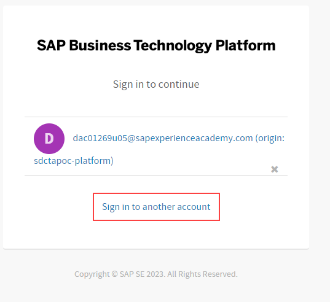
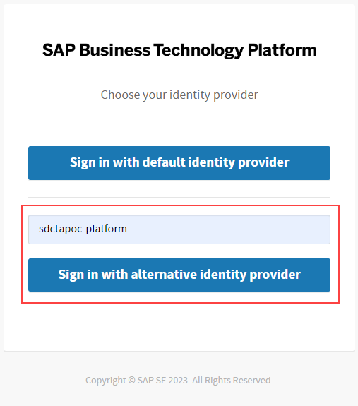
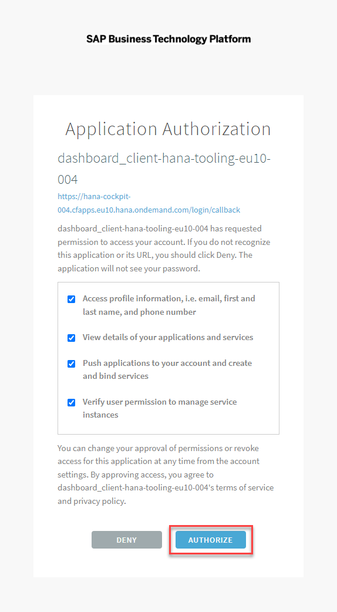
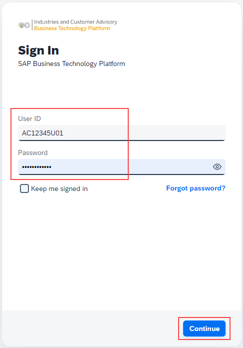
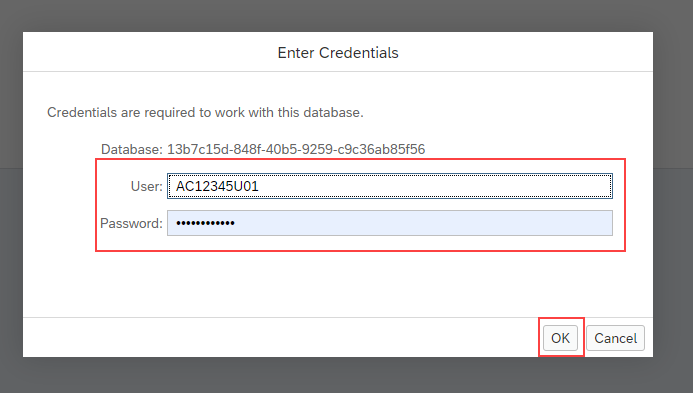
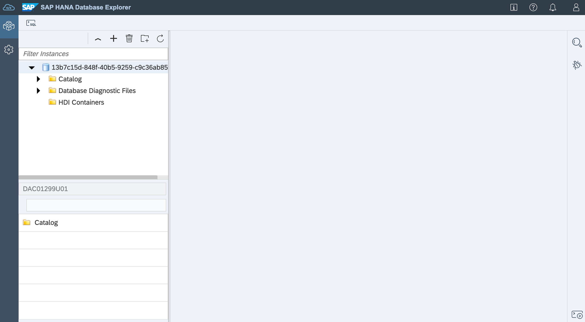
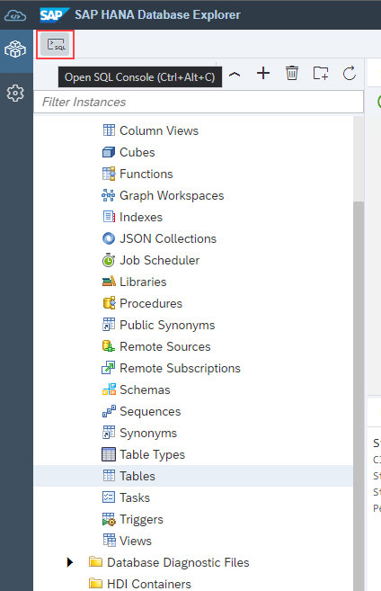
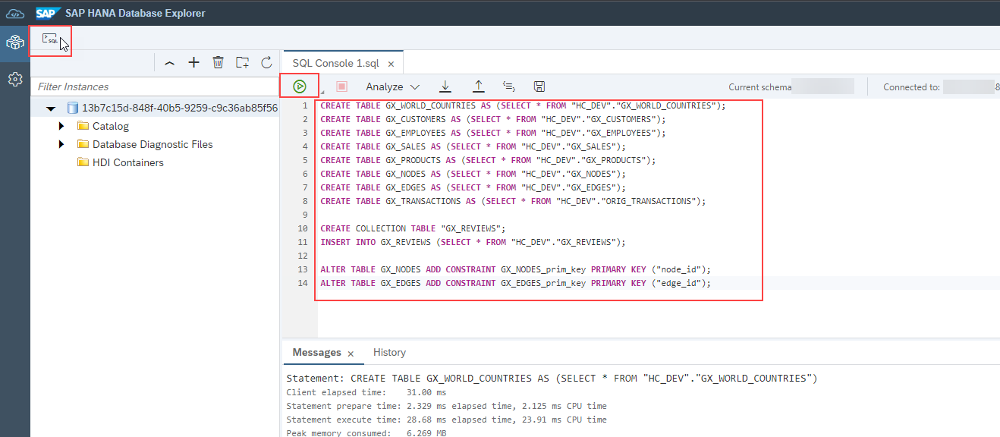
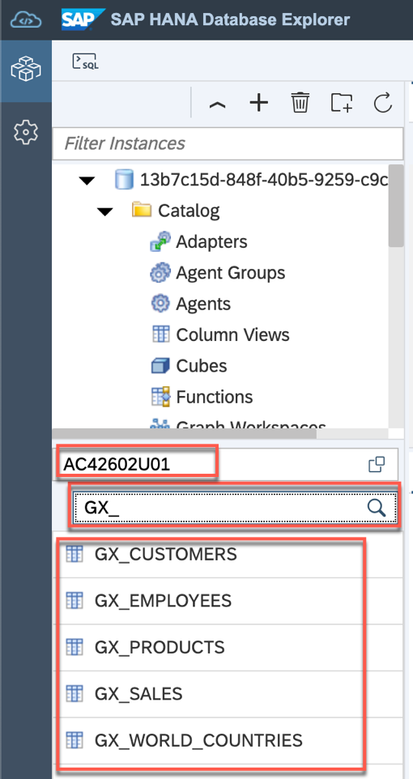

# The SAP HANA Cloud guided experience is an introductory tutorial experience for all users. The following modules can be completed in sequence or individually

- In-Memory Column Tables
- Data Tiering
- Multi-Model - Spatial
- Multi-Model - Document Store
- Multi-Model - Graph
- Multi-Model - AutoML Introduction

<!---**Important!** For all hands-on topics, please refer to the registration email received for details on accounts, passwords, and the date account expires. -->

</br>

 **Please Note:**

- For all hands-on topics, refer to the registration email for details of accounts, passwords, and the account expiration date.

- This exercise is for learning, non-productive use only. All data and objects associated with your account are not available after the account expires.

- After completing the *Getting Started* module, the other modules can be explored in any sequence.

<!--- **Note** the hands-on in this lesson is compulsory in order to explore any of the SAP HANA Cloud features in this workshop. All features are independent and can be explored in any sequence.--->

</br>

## Configure the Environment

<!---Before starting the lessons, the working environment must first be set up and configured. Get started by logging in to SAP Business Application Studio, then clone the project that will be used during the rest of the guided experience.--->

For the workshop we are using so called HANA Deployment Infrastructure Container also known as HDI-Containers. This will allow all participants to work in the same isolated environment (HDI container) without interfering with other participants.
Each of the modules within this guided experience use the same set of tables. These tables contain some generic transactional sales data including details of customers, products, employees as well as review and location data.
The tables and data will be deployed to the database in this step.
There are 2 tools we toggle between

- SAP Business Application Studio (*BAS*) which the browser version of Visual Studio Code (VSC)

- Database Explorer (*DBX*) for SAP HANA Cloud

The SAP Business Application Studio is a web-based tool to allow creating content for HDI and building application. It is a general purpose tool used widely in SAP also for CAP, No-LowCode, Fiori, mobile...
The SAP HANA database explorer is a web-based tool for browsing and working with SAP HANA database objects such as tables, views, functions, stored procedures. In addition, use DBX to import and export data, execute SQL statements, create remote sources, work with multi-model data such as graph, spatial and JSON collections, debug SQLScript, view trace files, and any other SQL activity.

</br>

### Cloning our project

1. Open the **SAP Business Application Studio**

**[BAS](https://da263-pj0569xc.ap11cf.applicationstudio.cloud.sap/index.html)**


2.  Select **Sign into another account**




3. Type  ****{placeholder|idpplatform}**** as the IDP and then select **Sign in with alternative identity provider**.


   <!-- **NOTE:** If you are an **SAP partner**, enter `academy-platform` and click on **Sign in with alternative identity provider** -->



</br>

>**Note:** If the following Application Authorization screen appears, click on **AUTHORIZE** to continue.

</br>



</br>

4. Enter the following:

   User: **{placeholder|userid}**

   Password: **Provided by registration e-mail**

  Then press the **Continue** button.



</br>

<!-- 5. Once you are in the Database Explorer, it will ask you for the credentials, use the same credentials as in earlier step to login to HANA Cloud. -->
5. Once logged into the SAP HANA Cloud Database Explorer, the application will prompt to enter credentials. For logging in to SAP HANA Cloud, use the same credentials as in the earlier step.




<!--  -->


</br>

The **SAP HANA Database Explorer** is ready:



</br>

After successfully logging in to the SAP HANA Cloud Database Explorer, the next step is to copy the data for the exercises.


</br>

### Create Tables

The tables and data for the exercises are available in a different read-only schema. The first step is to create copies of these tables in the local user schema (specified as **{placeholder|userid}**).

By the end of this section the following tables will be created under the schema **{placeholder|userid}**:

* GX_CUSTOMERS
* GX_EMPLOYEES
* GX_PRODUCTS
* GX_SALES
* GX_WORLD_COUNTRIES 
* GX_REVIEWS
* GX_EDGES
* GX_NODES
* GX_TRANSACTIONS

<!---We will first create copies and simultaneously populate tables involved, to our own local schema **{placeholder|userid}** with data from our source schema.--->

1. Click on the SQL icon in the top left corner of Database Explorer to open a new SQL Console.



2. Copy and paste the following SQL statements and execute them by clicking on the green **Run** icon or by pressing the **F8** function key.


```sql
CREATE TABLE GX_WORLD_COUNTRIES AS (SELECT * FROM "HC_DEV"."GX_WORLD_COUNTRIES");
CREATE TABLE GX_CUSTOMERS AS (SELECT * FROM "HC_DEV"."GX_CUSTOMERS");
CREATE TABLE GX_EMPLOYEES AS (SELECT * FROM "HC_DEV"."GX_EMPLOYEES");
CREATE TABLE GX_SALES AS (SELECT * FROM "HC_DEV"."GX_SALES");
CREATE TABLE GX_PRODUCTS AS (SELECT * FROM "HC_DEV"."GX_PRODUCTS");
CREATE TABLE GX_TRANSACTIONS AS (SELECT * FROM "HC_DEV"."ORIG_TRANSACTIONS");

-- Document Store Collection
CREATE COLLECTION TABLE "GX_REVIEWS";
INSERT INTO GX_REVIEWS (SELECT * FROM "HC_DEV"."GX_REVIEWS");

-- Graph Nodes and Edges
CREATE TABLE GX_NODES AS (SELECT * FROM "HC_DEV"."GX_NODES");
CREATE TABLE GX_EDGES AS (SELECT * FROM "HC_DEV"."GX_EDGES");

ALTER TABLE GX_NODES ADD CONSTRAINT GX_NODES_prim_key PRIMARY KEY ("node_id");
ALTER TABLE GX_EDGES ADD CONSTRAINT GX_EDGES_prim_key PRIMARY KEY ("edge_id");

-- SDI Replication Target (RT_) tables
CREATE COLUMN TABLE "RT_CUSTOMERS"(
	"CUSTOMER_ID" NVARCHAR(50),
	"CUSTOMER_LASTNAME" NVARCHAR(50),
	"CUSTOMER_FIRSTNAME" NVARCHAR(50),
	"CUSTOMER_SEX" NVARCHAR(50),
	"CUSTOMER_BIRTHDAY" NVARCHAR(50),
	"CUSTOMER_COUNTRY" NVARCHAR(50),
	"CUSTOMER_REGION" NVARCHAR(50),
	"CUSTOMER_REGIONNAME" NVARCHAR(50),
	"CUSTOMER_POSTCODE" NVARCHAR(50),
	"CUSTOMER_CITY" NVARCHAR(50),
	"CUSTOMER_STREET" NVARCHAR(50),
	"CUSTOMER_HOUSENUMBER" NVARCHAR(50),
	"CUSTOMER_LATITUDE" NVARCHAR(50),
	"CUSTOMER_LONGITUDE" NVARCHAR(50),
	"CUSTOMER_EMAIL" NVARCHAR(50),
	"CUSTOMER_PHONE" NVARCHAR(50)
)
UNLOAD PRIORITY 5 AUTO MERGE;

CREATE COLUMN TABLE "RT_EMPLOYEES"(
	"EMPLOYEE_ID" NVARCHAR(50),
	"EMPLOYEE_FIRSTNAME" NVARCHAR(50),
	"EMPLOYEE_LASTNAME" NVARCHAR(50),
	"EMPLOYEE_ACCOUNT_NO" NVARCHAR(50),
	"EMPLOYEE_SALARY" NVARCHAR(50),
	"EMPLOYEE_START_YEAR" NVARCHAR(50),
	"EMPLOYEE_GENDER" NVARCHAR(50),
	"EMPLOYEE_REGION" NVARCHAR(50),
	"EMPLOYEE_ZIPCODE" NVARCHAR(50),
	"EMPLOYEE_T-LEVEL" NVARCHAR(50),
	"EMPLOYEE_EDUCATION" NVARCHAR(50)
)
UNLOAD PRIORITY 5 AUTO MERGE;

CREATE COLUMN TABLE "RT_SALES"(
	"SALES_ID" NVARCHAR(50),
	"SALES_DATE" NVARCHAR(50),
	"SALES_TIME" NVARCHAR(50),
	"CUSTOMER_ID" NVARCHAR(50),
	"PRODUCT_ID" NVARCHAR(50),
	"QUANTITY" NVARCHAR(50),
	"DISCOUNT_PERCENTAGE" NVARCHAR(50),
	"DISCOUNT_AMOUNT" NVARCHAR(50),
	"PRICE" NVARCHAR(50)
)
UNLOAD PRIORITY 5 AUTO MERGE;


-- FlowGraph Data Transformation target table

CREATE COLUMN TABLE "FGT_DE_HE_CUSTOMERS"(
	"CUSTOMER_ID" NVARCHAR(50),
	"CUSTOMER_LASTNAME" NVARCHAR(50),
	"CUSTOMER_FIRSTNAME" NVARCHAR(50),
	"CUSTOMER_SEX" NVARCHAR(50),
	"CUSTOMER_BIRTHDAY" NVARCHAR(50),
	"CUSTOMER_COUNTRY" NVARCHAR(50),
	"CUSTOMER_REGION" NVARCHAR(50),
	"CUSTOMER_REGIONNAME" NVARCHAR(50),
	"CUSTOMER_POSTCODE" INTEGER,
	"CUSTOMER_CITY" NVARCHAR(50),
	"CUSTOMER_STREET" NVARCHAR(50),
	"CUSTOMER_HOUSENUMBER" NVARCHAR(50),
	"CUSTOMER_LATITUDE" REAL,
	"CUSTOMER_LONGITUDE" REAL,
	"CUSTOMER_EMAIL" NVARCHAR(50),
	"CUSTOMER_PHONE" NVARCHAR(50)
)
UNLOAD PRIORITY 5 AUTO MERGE;


```




</br>


<!-- Now we can confirm the details of our tables by selecting them in the Catalog. -->
Now, confirm the details of the tables by selecting them in the Catalog. Navigate to the Catalog section and choose the tables to review.

3. Expand **Catalog**, navigate to **Tables** and find the newly created tables.

>**Note:** Filter on own schema - **{placeholder|userid}** - and the table names if necessary to find them more easily.

<br>



</br>


<!-- Great! You have now set up your environment with all the necessary tables and populated them with data. You are ready to continue with the exercises!
First, take a look at the next lesson which introduces you to the *'Why'* of HANA. -->

**Congratulations!** The data and tools for the exercises are now ready for use. Please keep the DB Explorer window open as you continue through the exercises.
<!-- Before starting the exercises, it is recommended to take a look at the next lesson, which introduces the user to the importance and rationale behind using SAP HANA (*'Why'* of HANA). -->