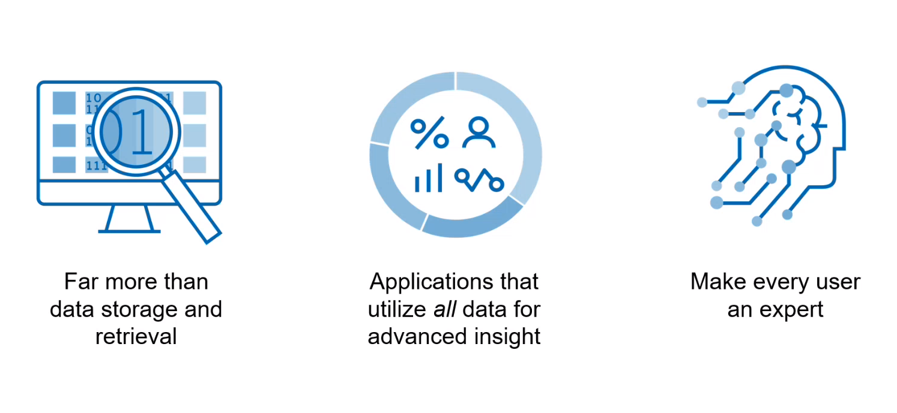
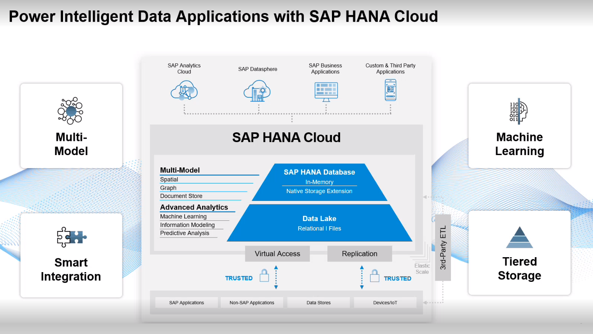
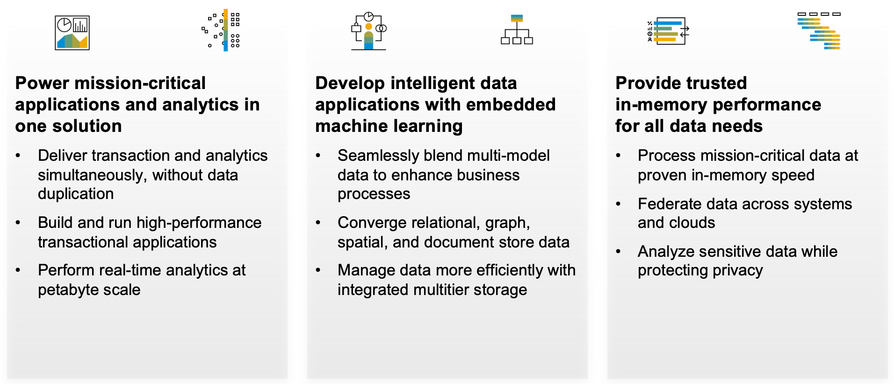

<!---SAP HANA Cloud is not just a fast database optimized for real-time processing, data compression and mixed OLTP/OLAP workloads.
It also boasts a lot of features such as Smart Data Integration, powerful Multi-Model engines and built-in Machine Learning capabilities.--->

<!---Intelligent Data Applications are ones which use the full power of the advanced features of SAP HANA Cloud to derive key decisions from the entire catalog of a company's dataset.--->

When a company incorporates data from the *entire* landscape to drive analytics and gain advanced insights, users can execute processes and make decisions like experts.

Modern organizations deliver this expertise to users with Intelligent Data Applications, or applications that access the full power of the database to derive key decisions using all relevant business data whether structured, semi-structured, or unstructured.

In today's fast-changing, technology-driven world, companies need to optimize their analytic capabilities, enhance their decision-making and maximize productivity in every aspect. However, there are multiple different obstacles traditional applications face to meet the modern user’s expectations.

 

### Business Challenges

 - Exponential growth of new types of business data
 - Reducing cost without increasing risk using hybrid landscapes with on-premise and cloud solutions
 - Deploying innovation that incorporates privacy and governmental regulations
 - Competitive and internal pressure to automate repetitive job functions 
 - Continuous cyber attacks jeopardizing enterprise data – and business reputations

 

### IT Challenges

- Huge volumes of data, often spread across multiple data silos
- Inability to scale on-premise architectures with demand
- Poor performance of error-prone manual data integration
- Slow business processes due to long ETL cycles
- Data disconnected from business context
- Use of advanced analytic processing like machine learning and multi-model capabilities
- Lack of skilled resources to support multiple disparate types of systems

 

> SAP HANA Cloud is the solution to overcome these challenges and power the next generation of Intelligent Data Applications.

SAP HANA Cloud is a database-as-a-service (DBaaS) that delivers a single view of the entire data landscape. As the cloud-based data foundation for the SAP Business Technology Platform, SAP HANA Cloud orchestrates mission-critical applications and analytics across all enterprise data in one complete solution.

 

SAP HANA Cloud Key Features:

* **Tiered Storage** 
  Native in-memory storage delivers extremely fast access to data, but there are options for storing less time-critical use cases. Data can be stored on disk using SAP HANA Cloud’s native storage extension (NSE), while larger amounts of even less critical data can be stored in the SAP HANA Cloud data lake.

* **Smart Integration** 
  SAP HANA Cloud can connect with many sources to bring data into the database. In addition, the database can also delegate processing to a remote data source without having to first create a local copy of the data. This smart data federation and integration feature simplifies the data architecture by eliminating the need for unnecessary duplicate copies of the data.

* **Multi-Model** 
  SAP HANA Cloud includes advanced analytic engines such as Graph, Spatial and Document Store. Use spatial processing to solve business problems using maps and geography. The graph engine can analyze relationships between the entities of a dataset. The Document Store handles semi-structured data such as JSON documents.
  
* **Embedded Machine Learning** 
  By pushing down AI processing into the database, SAP HANA Cloud enables the application builder to analyze trends and make predictions on future outcomes.

 

### Power Intelligent Data Applications using SAP HANA Cloud

The subsequent lessons demonstrate how SAP HANA Cloud can meet all the data requirements of a modern data landscape. Use the practical examples and step-by-step instructions to learn how SAP HANA Cloud can modernize existing applications or serve as the cloud database for a new project.

