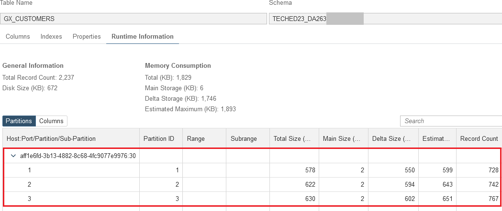
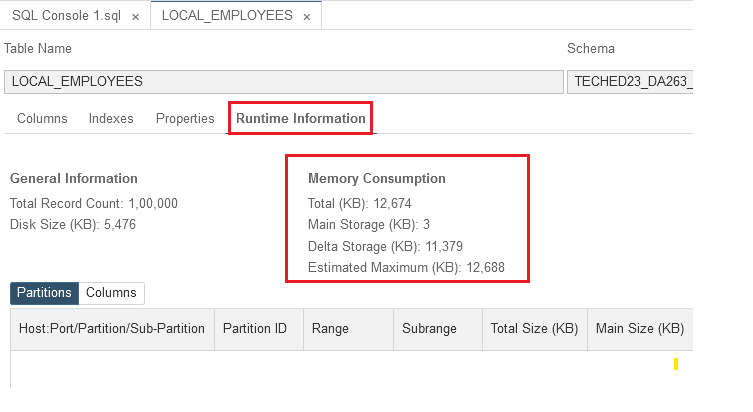

The SAP HANA Cloud database stores data in memory using both column and row tables. Application builders can use column tables for almost every use case.


## Advantages of Column-Based Storage

Column tables have several advantages:

- **Higher data compression rates** </br>
  In-memory columnar data storage natively utilizes compression to store data. Advanced compression techniques are available since all of the column’s data resides in memory versus on disk.

- **Higher performance for column operations such as searching and mathematical operations** </br>
  With columnar data organization, operations on single columns are as easy as iterating through an array with the added benefit of parallel operations and optimized storage designed for fast and efficient searches.

- **Elimination of the need for secondary indexes** </br>  
  In many cases, columnar data storage eliminates the need for additional index structures since storing data in columns already works like having a built-in index for each column. Eliminating secondary indexes reduces memory size, can improve write performance, and reduces development efforts.

- **Elimination of materialized aggregates** </br>
  The database uses the column store to aggregate large amounts of data with high performance and without the need for materialized aggregates. A leaner data architecture provides application builders many benefits including simplifying the data model, optimal code opportunities to accomplish business logic, and data that is always current.

- **Parallelization** </br>  
  Column-based storage also simplifies parallel execution using multiple processor cores. In a column store, data is already vertically partitioned. That means operations on different columns can easily be processed in parallel.

------
### Try it out!


1. Let's explore how to create Row and Column tables in SAP HANA Cloud using Business Application studio. Tables can be created in HANA using hdbtable and hdbmigrationtable artifacts.The DA263 project already has tables defined in HDBTABLE folder.Double click on the artifact GX_CUSTOMERS.hdbtable to view its definition


2. Open Database Explorer to view its runtime artifact.


3. View the properties of a table by clicking on the table name.Click on Tables, Filter on *GX_CUSTOMERS* and then click on **Properties** in the tab to the right.


Upon clicking on **Properties** for the selected table, the additional details about the table appears including name, schema, size, and other relevant information.

4. Look for the **Table Type** property, and you will see it is listed as a **COLUMN** table.


5. Click on the **Runtime Information** tab to see the runtime details such as memory usage, disk size and record count.


To create a Row table, define the table type as ROW in the hdbtable artifact.

**Note** : **Row tables are not recommended to use in production.** This exercise is for educational purposes to highlight the difference in memory consumption and performance between column and row store tables

6. Navigate to Business Application Studio.Select your project folder in the workspace and click F1 to open Command Palette or click View -> Command Palette


7. Type HANA to view the available commands with SAP HANA module. Click on **SAP HANA: Create SAP HANA Database Artifact**


8. In the **Create SAP HANA Database Artifact** interface, add */HDBTABLE* to the path as we want to create hdbtable artifacts in HDBTABLE folder.Select *Table(hdbtable)* as the **artifact type** and type *GX_CUSTOMERS_ROW* as **artifact name**

Note: Please make sure the path specified to create artifact is in the below format **/home/user/projects/teched2023-DA263/db/src/HDBTABLE/**.Replace or adapt *teched2023-DA263*  with your project folder/(s) name if you imported the project with a different name or structure.


9. Click on **Create**


10. Replace the following content into the *GX_CUSTOMER_ROW.hdbtable* file.

```sql
ROW TABLE "GX_CUSTOMERS_ROW" ("CUSTOMER_ID"  NVARCHAR(50)  NOT NULL,
"CUSTOMER_LASTNAME"  NVARCHAR(50),
"CUSTOMER_FIRSTNAME"  NVARCHAR(50),
"CUSTOMER_SEX"  NVARCHAR(2),
"CUSTOMER_BIRTHDAY"  DATE,
"CUSTOMER_COUNTRY"  NVARCHAR(50),
"CUSTOMER_REGION"  NVARCHAR(50),
"CUSTOMER_REGIONNAME"  NVARCHAR(50),
"CUSTOMER_POSTCODE"  NVARCHAR(10),
"CUSTOMER_CITY"  NVARCHAR(50),
"CUSTOMER_STREET"  NVARCHAR(50),
"CUSTOMER_HOUSENUMBER"  NVARCHAR(50),
"CUSTOMER_LATITUDE"  DECIMAL(22,8),
"CUSTOMER_LONGITUDE"  DECIMAL(22,8),
"CUSTOMER_EMAIL"  NVARCHAR(50),
"CUSTOMER_PHONE"  NVARCHAR(50)
, primary key  ( 
  "CUSTOMER_ID")
)
```
11. Deploy the newly created table from *SAP HANA PROJECTS* view.


12. Open **Database Explorer**.The newly created table can now be seen Tables section in Database Explorer. CLick on *Open SQL Console* button as shown below and execute the following SQL to insert data


```SQL
INSERT INTO "GX_CUSTOMERS_ROW" SELECT * FROM "GX_CUSTOMERS"
```


13. Click on the table *GX_CUSTOMERS_ROW* to open the details.


14. Now select the runtime tab and observe the *Memory Consumption* details. The amount of memory required for a row table is higher than with the same data residing in a column table.


Column tables are more efficient and support faster query processing than row tables. For further information on data storage in SAP HANA Cloud, click [here](https://help.sap.com/docs/hana-cloud-database/sap-hana-cloud-sap-hana-database-administration-guide/columnar-and-row-based-data-storage).

------
## Table Partitioning

The partitioning feature of the SAP HANA Cloud database splits column-store tables into smaller, more manageable parts.

Partitioning is transparent for SQL queries and data manipulation language (DML) statements. There are additional data definition statements (DDL) for partitioning itself:

- Create table partitions
- Re-partition tables
- Merge partitions to one table
- Add/delete partitions
- Perform the delta merge operation on certain partitions

</br>

When a table is partitioned, the split is done in such a way that each partition contains a different set of rows of the table. There are several alternatives available for specifying how the rows are assigned to the partitions of a table, for example, hash partitioning or partitioning by range.

The following are the typical advantages of partitioning:

**Large table sizes** </br>
Each partition as well as a table without partitions can store 2 billion records. Adding more partitions to a table configures the table for more capacity.

**Parallelization** </br>
Partitioning allows operations to be parallelized by using several execution threads for each table.

**Partition pruning** </br>
Queries are analyzed to determine whether or not they match the given partitioning specification of a table (static partition pruning) or match the content of specific columns in aging tables (dynamic partition pruning). If a match is found, it is possible to determine the specific partitions that hold the data being queried and avoid accessing and loading into memory partitions which are not required.


</br>

------
### Try it out!

Explore how to partition a table using practical examples. For demonstration purposes, use the **GX_CUSTOMERS** table, which contains around 2000 records. Note that any table can be partitioned.

Currently, the GX_CUSTOMERS table does not contain any partitions, and all 2000 records are in a single table. Confirm by examining the metadata of the table in the SAP HANA Cloud Database Explorer. Upon inspection, observe that the Partition tab is blank, indicating the absence of any partitions in the table.


By clicking on the **Columns** tab, it can be seen that all columns are sitting on Partition ID = 0:


Now let's partition the table.There are two ways to partition an existing table created by *.hdbtable* plugin:

   a. Modify the existing *.hdbtable* artifact definition and deploy. The *.hdbtable* plugin creates a new table with modified definition and does an internal table-copy from the old version.

   b. Replace the *.hdbtable* artifact with a *.hdbmigrationtable* artifact.In contrast to the table plug-in (.hdbtable), the migration-table plug-in (.hdbmigrationtable) uses explicit versioning and migration tasks, which means that the modifications of the database table are explicitly specified in the design-time file and carried out on the database table exactly as specified, without incurring the cost of an internal table-copy operation.This behavior makes the .hdbmigrationtable plug-in especially useful for tables that contain a lot of data.

For this exercise, we will modify the existing *.hdbtable* artifact.

1. Go to BAS and open GX_CUSTOMERS.hdbtable. Replace its content with the following.

```sql
column table "GX_CUSTOMERS" (
   "CUSTOMER_ID"  NVARCHAR(50)  NOT NULL,
   "CUSTOMER_LASTNAME"  NVARCHAR(50),
   "CUSTOMER_FIRSTNAME"  NVARCHAR(50),
   "CUSTOMER_SEX"  NVARCHAR(2),
   "CUSTOMER_BIRTHDAY"  DATE,
   "CUSTOMER_COUNTRY"  NVARCHAR(50),
   "CUSTOMER_REGION"  NVARCHAR(50),
   "CUSTOMER_REGIONNAME"  NVARCHAR(50),
   "CUSTOMER_POSTCODE"  NVARCHAR(10),
   "CUSTOMER_CITY"  NVARCHAR(50),
   "CUSTOMER_STREET"  NVARCHAR(50),
   "CUSTOMER_HOUSENUMBER"  NVARCHAR(50),
   "CUSTOMER_LATITUDE"  DECIMAL(22,8),
   "CUSTOMER_LONGITUDE"  DECIMAL(22,8),
   "CUSTOMER_EMAIL"  NVARCHAR(50),
   "CUSTOMER_PHONE"  NVARCHAR(50)
, primary key  ( 
     "CUSTOMER_ID")
) PARTITION BY HASH("CUSTOMER_ID") PARTITIONS 3;
```
2. Deploy the updated artifact.


This will partition the *GX_CUSTOMERS* table into 3 partitions, via a *HASH* partition function on the *CUSTOMER_ID* column.

3. Open Database Explorer.Refresh the metadata screen for the table, and you should now see that GX_CUSTOMERS is now made up of 3 separate partitions.



4. Run the following SQL query in the console and observe the result:

```sql
SELECT COUNT(*) FROM GX_CUSTOMERS;
```

5. Upon querying the table, it can be observed that around 2000 records are returned as the result. Despite the fact that the table has been partitioned into three separate partitions, there is no need to make any alterations to the queries performed on the table. The partitioning is handled transparently by SAP HANA Cloud, ensuring that the query results remain consistent and accurate without requiring any modifications to the queries themselves.

5. We can merge all the partitions and return to one single table by replacing the GX_CUSTOMERS.hdbtable content to its original definition and deploying the artifact again:

```sql
column table "GX_CUSTOMERS" (
   "CUSTOMER_ID"  NVARCHAR(50)  NOT NULL,
   "CUSTOMER_LASTNAME"  NVARCHAR(50),
   "CUSTOMER_FIRSTNAME"  NVARCHAR(50),
   "CUSTOMER_SEX"  NVARCHAR(2),
   "CUSTOMER_BIRTHDAY"  DATE,
   "CUSTOMER_COUNTRY"  NVARCHAR(50),
   "CUSTOMER_REGION"  NVARCHAR(50),
   "CUSTOMER_REGIONNAME"  NVARCHAR(50),
   "CUSTOMER_POSTCODE"  NVARCHAR(10),
   "CUSTOMER_CITY"  NVARCHAR(50),
   "CUSTOMER_STREET"  NVARCHAR(50),
   "CUSTOMER_HOUSENUMBER"  NVARCHAR(50),
   "CUSTOMER_LATITUDE"  DECIMAL(22,8),
   "CUSTOMER_LONGITUDE"  DECIMAL(22,8),
   "CUSTOMER_EMAIL"  NVARCHAR(50),
   "CUSTOMER_PHONE"  NVARCHAR(50)
, primary key  ( 
     "CUSTOMER_ID")
)
```
</br>

Refresh the metadata screen for the table to see that it is a non-partitioned table again.


</br>

## Data In Memory

SAP HANA Cloud is an 'In-Memory' database, meaning that it stores data in a computer’s main memory (RAM) instead of on traditional disks or solid-state drives (SSD). While most databases today have added more in-memory capabilities, they are still primarily a disk-based storage database. SAP HANA Cloud was built from the ground up to work with data in-memory and leverage other storage mechanisms as necessary to balance performance and cost. Retrieval from memory is much faster than from a disk or SSD, resulting in split-second response times.

Therefore, memory is a fundamental resource of the SAP HANA Cloud database. Understanding how the SAP HANA Cloud database requests, uses, and manages this resource is crucial to the understanding of SAP HANA Cloud.

## Overview of HANA Used Memory

The dominant part of the used memory in the SAP HANA Cloud database is the space used by data tables. Separate measurements are available for column-store tables and row-store tables.


The column store is the part of the SAP HANA Cloud Database that manages data organized in columns in memory. This enables high data compression rates and faster aggregations. 


The column store is optimized for both read and write operations. This is achieved through two data structures: Main storage and Delta storage.


To demonstrate the concept, create a copy of the **GX_EMPLOYEES** table with Delta Merge initially disabled. This will allow us to examine the behavior of the table without the Delta Merge feature. Subsequently, the table will be populated with data for further analysis.


1. Open BAS and create *LOCAL_EMPLOYEES.hdbtable* file in */HDBTABLE* folder with following content and deploy

```sql
column table "LOCAL_EMPLOYEES" (
   "EMPLOYEE_ID"  NVARCHAR(50)  NOT NULL,
   "EMPLOYEE_FIRSTNAME"  NVARCHAR(50),
   "EMPLOYEE_LASTNAME"  NVARCHAR(50),
   "EMPLOYEE_ACCOUNT_NO"  NVARCHAR(50),
   "EMPLOYEE_SALARY"  DECIMAL(8,2),
   "EMPLOYEE_START_YEAR"  INTEGER,
   "EMPLOYEE_GENDER"  NVARCHAR(1),
   "EMPLOYEE_REGION"  NVARCHAR(50),
   "EMPLOYEE_ZIPCODE"  NVARCHAR(50),
   "EMPLOYEE_T-LEVEL"  NVARCHAR(50),
   "EMPLOYEE_EDUCATION"  NVARCHAR(50)
, primary key  ( 
"EMPLOYEE_ID", "EMPLOYEE_START_YEAR")
) NO AUTO MERGE
```


>**Note:** It is important to note that when creating a table in SAP HANA Cloud, the Delta Merge feature is automatically enabled by default. There is no need to explicitly specify how the table should handle the auto merge process during creation. However, in this situation, we are specifying "No Auto Merge" for demonstration purposes to showcase the behavior without Delta Merge. For further information on the delta merge process, click [here](https://help.sap.com/docs/hana-cloud-database/sap-hana-cloud-sap-hana-database-administration-guide/delta-merge-operation).

<br>

Now it is possible to check the details of this table by selecting it in the Catalog.

2. Expand **Catalog** in Database Explorer, navigate to **Tables** and find the newly created table under the container schema.

>**Note:** Filter on table name if necessary to find it more easily.

Open SQL Console and execute the following SQL to insert data

```sql
INSERT INTO LOCAL_EMPLOYEES SELECT * FROM GX_EMPLOYEES;
```


3. Select the **LOCAL_EMPLOYEES** table to see its meta data.

Note a list of all the table columns, and their data types:

4. Select the **Runtime Information** tab.


In the table details section, users will find additional information about the table, including the number of records, table size in memory and on disk, as well as details about partitions and columns. Specifically, the **Memory Consumption** section provides insights relevant to our current focus.

In here, users can explore and analyze the memory consumption of the table, which is crucial for understanding the resource utilization and performance implications. By examining the memory consumption metrics, users can gain valuable insights into the table's memory footprint and make informed decisions regarding table management and optimization.





From here, the total memory size of the table, along with how much of that is currently in the Delta Store and how much is in the Main Store, can be seen. Observe the fact that all the data is currently in delta, and the size of the table in memory is over 12 MB.

>**Note:** As we created the table with *AUTO MERGE* switched off, all of the recently inserted data is currently residing in Delta. This is not the typical situation as tables in SAP HANA Cloud are created with *AUTO MERGE* enabled by default. This is just for the purposes of this guided experience, as the merge into main store would have already taken place by the time we opened the information in Database Explorer.

Now let's run some statements against this table and observe the results.

5. Copy and paste the following SQL query into an SQL console and execute it by clicking on the green **Run** icon or by pressing the **F8** function key.

```sql
SELECT * FROM "LOCAL_EMPLOYEES";
```
6. Once the results are returned, click on **Messages** to see the execution statistics.


Observe the main attributes of the query, such as *Elapsed Time*, *Prepare Time* and *Peak Memory consumed*.

7. Now run the statement again by pressing the **F8** key once more, and observe the differences in these attributes.


The time for statement preparation has reduced significantly, as this statement is now stored in the statement cache. Memory used has also been reduced.

The next step is to perform a delta merge on the table and observe the results.

8. Copy and paste the following into an SQL console and execute it:

```sql
MERGE DELTA OF "LOCAL_EMPLOYEES";
```

9. Now return to the tab which has the meta data of the *LOCAL_EMPLOYEES* table open, and click refresh to observe the change in memory statistics.


The total memory consumption of the table has been reduced significantly, and the majority of the data is now stored in the Table's Main Storage area.

 
Let's repeat the previous steps of running a *Select* SQL query against the table and observing the resulting statistics.

10. Copy and paste the following SQL query and execute it:

```sql
SELECT * FROM "LOCAL_EMPLOYEES";
```


11. Once the results are returned, click on **Messages** to see the execution statistics.


Note that the Execution time, Prepare time and Memory used in the query should all be quite similar to the 2nd execution above.

From the latest execution of the statement, the following conclusions can be drawn:

* By merging the table data from Delta store to Main store, the data becomes highly compressed.
* The statement read performance is not negatively impacted by this highly compressed state
* Writing to the table is optimized by utilizing the Delta store of the table which is a Row-based table.

</br>

## Data Loaded In-Memory

In regards to data loading, there are different states for a Column table in HANA:

* **Unloaded** - none of the column store data is loaded to main memory.
* **Partially Loaded** - parts of the column store data are loaded to main memory e.g. only a few columns recently used in a query.
* **Fully Loaded** - all data of the column store is loaded into main memory.

Normally, SAP HANA Cloud manages the loading and unloading of tables with the aim to keep all relevant data in memory.

Column tables are loaded on demand, column by column when they are first accessed. This means that columns that are never used will not be loaded and memory waste is avoided. When the SAP HANA Cloud database runs out of allocate-able memory, it will try to free up some memory by unloading unimportant data (such as caches) and even table columns that have not been used recently. 

Though usually not necessary, it is possible to manually load and unload tables or columns from memory.
Have a look at this in order to show the impact on performance.

1. Select the **LOCAL_EMPLOYEES** table from the Explorer window on the left to open its meta data.

2. In the **Runtime Information** tab, select **Columns** to see more details about the table columns.


3. As already seen, running queries on this table and selecting all columns, will result in each column being loaded into memory (Loaded status = 'TRUE').


4. Run the following SQL query again just to observe the runtime:

```SQL
/* Columns loaded in memory */
SELECT * FROM "LOCAL_EMPLOYEES";
```

5. Observe a similar runtime to before.


6. Force the table to be unloaded from memory. Copy and paste the following SQL, then execute it in the SQL console:

```SQL
UNLOAD "LOCAL_EMPLOYEES";
```


7. Go back to the tab with the meta data for the table still open, click on **refresh** and observe the updated values. The Loaded column is now set to 'FALSE' for all columns of the table.


8. Now run the **`SELECT *`** query again and observe the run-times. Either return to the SQL console that was previously open, and re-run the statement, or copy and paste the following SQL into a new console and execute:

```SQL
/* Columns not loaded into memory */
SELECT * FROM "LOCAL_EMPLOYEES";
```

> **Note** that the statement execution time includes an initial load back into memory.


9. As the previous query used all columns, the table should be fully loaded into memory again. To check this, click on 'Refresh' in the table metadata tab and observe the values in the 'Loaded' column.


</br>

### Partially Loading Data

In the above examples, everything was selected from the table with a **```SELECT *```** query, thus SAP HANA Cloud will load the whole table into memory.
But what if we are only interested in a subset of columns in the table? In many database transactions, queries will typically be designed to select only the relevant data from the tables involved, as this results in better performance.

Let's observe what happens when a query is executed that only selects a few columns from the table.

1. Unload the entire table from memory as it is currently fully loaded. Execute the following query in the SQL console:

```SQL
UNLOAD "LOCAL_EMPLOYEES";
```

>**Note:** Double-check if the table has been unloaded by refreshing the table metadata screen as before, and verifying the *Loaded* column is set to *FALSE* for all columns.


2. Run the following query which only selects four columns from our table:

```sql
/* Select certain columns only - columns not yet in memory */
SELECT EMPLOYEE_ID, (EMPLOYEE_FIRSTNAME || ' ' || EMPLOYEE_LASTNAME) AS NAME, EMPLOYEE_SALARY
FROM "LOCAL_EMPLOYEES"
WHERE EMPLOYEE_SALARY > 50000;
```

3. After the query has finished, refresh the metadata tab for the table and check the **Loaded** column. Only the four columns used in the query are set to *TRUE*. This means all data that was not relevant for the query was left on disk, and *only the required data* was moved to main memory.


**Well done!** By now, you have acquired a solid understanding of in memory column tables and the advantages they offer. You now have experience creating these types of tables, exploring table properties, and effectively creating partitions for improved performance and data management.

- Continue to - [Exercise 2 - DATA-TIERING](../9_2_HC_DataTiering/README.md)
- Continue to - [Main page](../../README.md)
