The speed at which a business accesses its data varies based on many different conditions. SAP HANA Cloud provides the capability to use additional storage tiers other than memory to store data based on access speed and data density needs. SAP HANA Native Store Extension (NSE) is the disk storage option for use with data less frequently accessed than in memory. Memory is still utilized but only for the data that is being used. The SAP HANA data lake also offers high density storage at capacities far greater than possible using the other storage tiers.


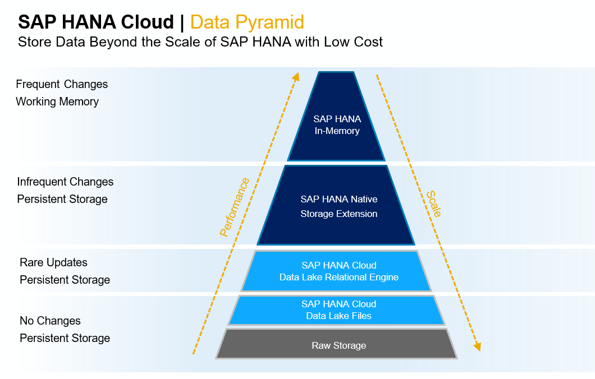

<!---Some of the tiered storage options available to manage large amounts of data beyond the scale of SAP HANA Cloud are **SAP HANA Native Storage Extension (NSE)** and **SAP HANA Data Lake**.
</br>

>**Note:** The rest of this lesson will focus on SAP HANA Native Storage Extension (NSE). For more information on SAP HANA Data Lake, please see the appendix at the end of this Academy.--->

Let's look at SAP HANA Cloud NSE in more detail, with some practical examples to enhance the understanding.

## SAP HANA Native Storage Extension

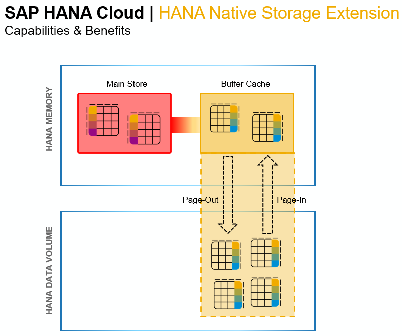

<!---**Capabilities:**</br>
* Intelligent buffer cache to transfer pages of data between memory and disk
* Data is partly in memory, and partly on disk by splitting tables, columns, or partitions between memory and disk storage
* Collect statistics of data access to support data placement recommendations

**Benefits:**</br>
* Memory footprint reduction (8x - 10x)
* Acceptable lower performance (2x – 3x slower)
* Increased data capacity
* Cost-efficient use of system resources according to business priorities
</br>

<!---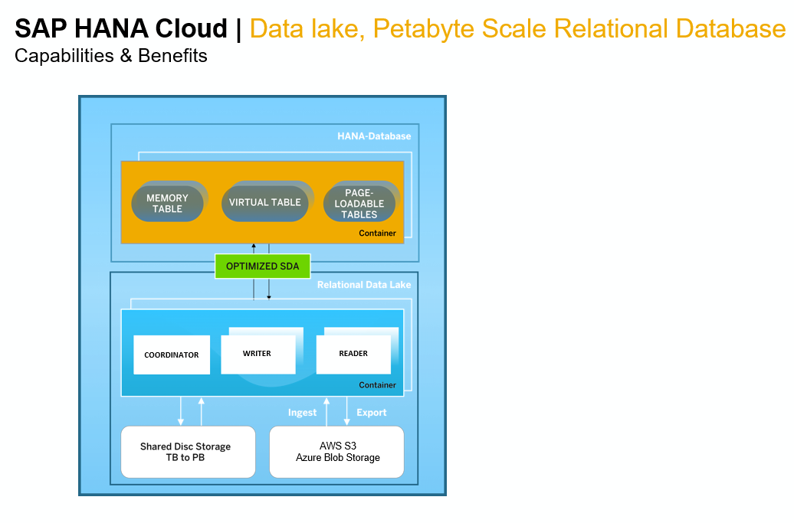

**Capabilities:**</br>
* Integrated into HANA Cloud Instance
* Automatically provisioned and administered with HANA Cloud
* Based on existing SAP technology
* Highly optimized SDA connection including *"query delegation"*
* Elastic scale, independent of SAP HANA DB
* High-speed ingestion enablement 
* Access to cloud storage (e.g. AWS S3, GCP Cloud Storage)
* Shared storage using the NetAppCloud Volumes Service


**Benefits:**</br>
* Ingest any data from cloud or on-premise data sources
* Easy to set up and use (single access layer in HANA Cloud)
* Low TCO 
* Fast analytic processing through columnar architecture
--->
</br>


SAP HANA Native Storage Extension (NSE) is a general-purpose, built-in warm data store in SAP HANA Cloud which allows management of less-frequently accessed data without fully loading it into memory. 

<!---It integrates disk-based or flash-drive based database technology with the SAP HANA in-memory database for an improved price-performance ratio.--->

Warm data is primarily used to store read-only data that doesn't require frequent access. The data need not reside continuously in SAP HANA memory, but is still managed as a unified part of the database ― transactionally consistent with hot data, and participating in backup and system replication operations, and is stored in lower cost stores within SAP HANA Cloud.

<!---Cold data is used to store read-only data, with very infrequent access requirements. Managing cold data separately from the SAP HANA Cloud database, but can still be accessed it from SAP HANA Cloud using SAP HANA’s data federation capabilities.--->

This image shows the difference between standard HANA in-memory storage and the storage offered with NSE:

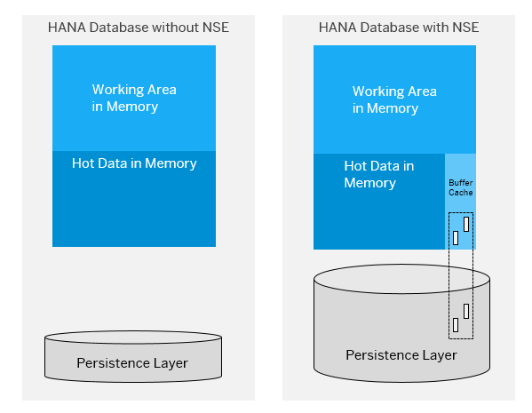

The SAP HANA Native Storage Extension (NSE) feature for warm data storage is enabled by default in SAP HANA Cloud. Database developers may choose to assign specific tables, columns, or partitions to use NSE. SAP HANA NSE uses a dedicated in-memory buffer cache to load and unload pages of tables, table partitions or table columns. 
<!---The initial buffer cache size of an SAP HANA Cloud instance is 10% of the instance's memory size. Changing the initial buffer cache size once the SAP HANA instance has been created--->

>**Note:** The NSE feature in SAP HANA Cloud does not require modification to applications.

------
### Try it out!

<!---In this exercise we will walk through the steps of enabling NSE for a table and observe how NSE helps in managing the data in a hot-warm configuration.--->
The following exercise demonstrates how to enable Native Storage Extension for a table and leverage its advantages in managing warm data. 

This example uses the **GX_EMPLOYEES** columnar table containing 100,000 records, with its default persistency "in-memory" (hot).

1. Open the Database Explorer, and expand **Tables** and find the **GX_EMPLOYEES** table.

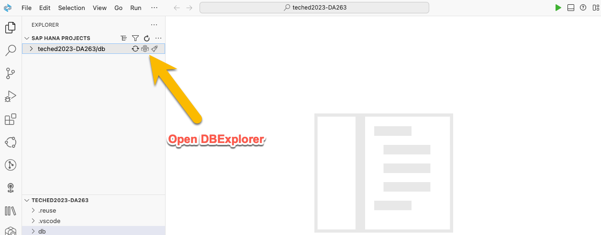

***open GX_EMPLOYEES***


2. Click on the table to open the meta data screen.

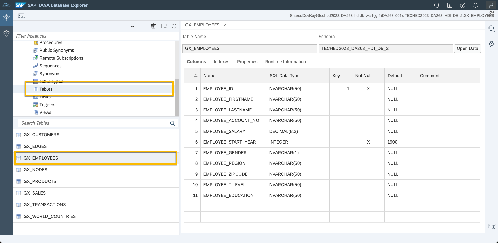


3. Select the **Runtime Information** tab to view record count and memory consumption.

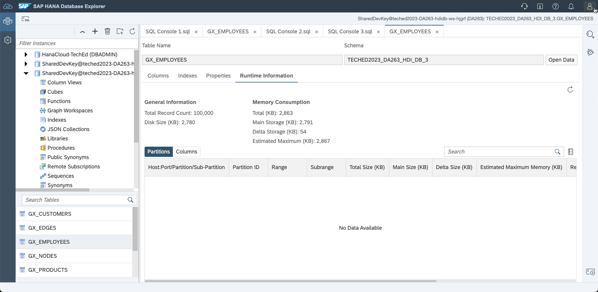

To free up memory, this table will be partitioned and some data will move to the NSE warm storage tier.

<!--- Consider a situation where we might need to free up space in memory. We can partition this table as we saw in the last lesson, and then move a partition to Warm Storage (NSE) to see the effect on memory usage.--->

4. This is done by partitions. If a partition is ***"PAGE LOADABLE"*** it is send to NSE storage. For the sample we choose START_YEAR. Only to show the principle of NSE. From a business perspective this may not make sense.

```sql
Acolumn table "GX_EMPLOYEES" (
   "EMPLOYEE_ID"           NVARCHAR(50)      NOT NULL,
   "EMPLOYEE_FIRSTNAME"    NVARCHAR(50),
   "EMPLOYEE_LASTNAME"     NVARCHAR(50),
   "EMPLOYEE_ACCOUNT_NO"   NVARCHAR(50),
   "EMPLOYEE_SALARY"       DECIMAL(8,2),
   "EMPLOYEE_START_YEAR"   INTEGER           NOT NULL DEFAULT 1900,
   "EMPLOYEE_GENDER"       NVARCHAR(1),
   "EMPLOYEE_REGION"       NVARCHAR(50),
   "EMPLOYEE_ZIPCODE"      NVARCHAR(50),
   "EMPLOYEE_T-LEVEL"      NVARCHAR(50),
   "EMPLOYEE_EDUCATION"    NVARCHAR(50),
   primary key  ("EMPLOYEE_ID")
   
      ) 
      PARTITION by 
         HASH ("EMPLOYEE_ID") PARTITIONS 1 SUBPARTITION BY
            RANGE("EMPLOYEE_START_YEAR")
            (
               (PARTITION 0 <= values < 2008 
                  page loadable GROUP NAME 'HISTORY'),
               (PARTITION others)
            )

```

To run this change we have prepared a GX_EMPLOYEES.hdbmigrationtable.
Rename both files before deploying again

- /db/src/HDBTABLE/GX_EMPLOYEES.hdbtable -> GX_EMPLOYEES.hdbtable.txt
- /db/src/HDBMIGRATIONTABLE/GX_EMPLOYEES.hdbmigrtiontable.txt -> GX_EMPLOYEES.hdbmigrationtable

This will change the table to be partitioned. Also you learned how to convert a *.hdbtable to a *.hdbmigrationtable artifact.
Deploy now


5. Refresh the **Runtime Information** tab for the GX_EMPLOYEES table and select the **Partitions** tab. Two partitions have been created and *Loaded Status* for them is *FULL*, meaning both partitions are fully loaded into memory. 
Note the current **Total Memory Consumption** which is 2.8 MB for the table in memory.

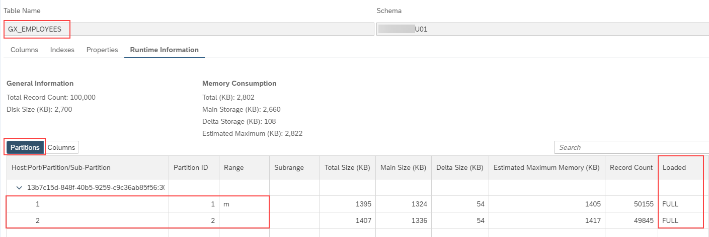

6. Issue the following command via the SQL console to move partition 1 to NSE:

```SQL
ALTER TABLE "GX_EMPLOYEES"
ALTER PARTITION 1 PAGE LOADABLE;
```

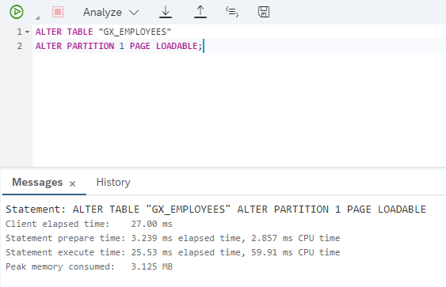

7. Return to the metadata screen for the *GX_EMPLOYEES* table and click the refresh button to update the figures.

8. The **Loaded** status of partition 1 has changed to *partially loaded* and total memory consumption by the table has been reduced:

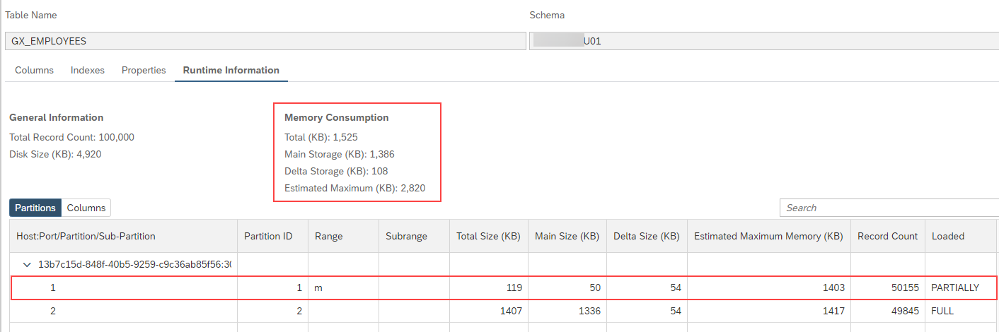

The reason for the memory reduction is because the records from partition 1 are now stored as warm data on disk.

9. Issue the following command via the SQL console to query the total number of records in the table:

```sql
SELECT COUNT(*) FROM GX_EMPLOYEES;
```

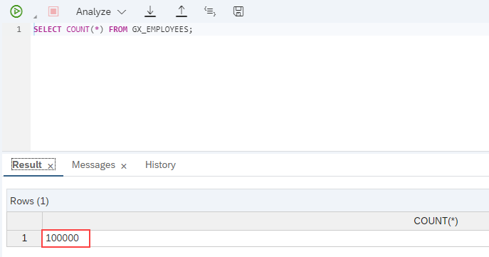

Observe that while half of the table is in memory (hot), with the other half on disk (warm), the table is still treated as a whole when queried.

10.  Now merge partitions and change the entire table to hot (COLUMN LOADABLE).

```SQL
ALTER TABLE "GX_EMPLOYEES" MERGE PARTITIONS;
```

11.  Refresh the contents of the runtime information tab for the **GX_EMPLOYEES** table again. Observe that the "Total Memory Consumption" has been set back to earlier standard and there are no partitions.

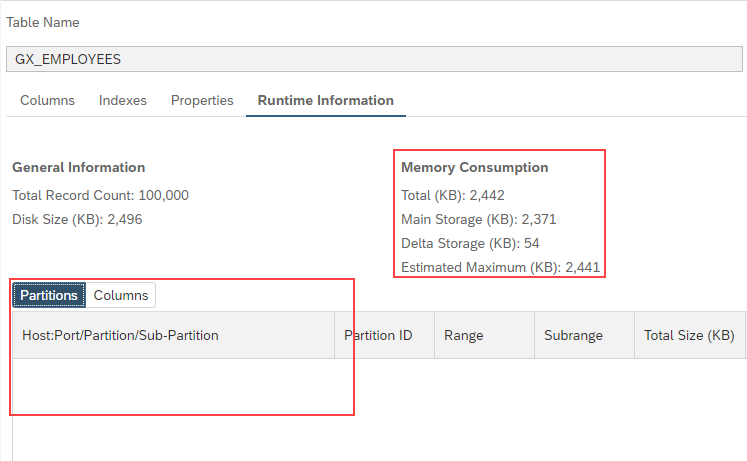


Now move the entire table to warm storage (PAGE LOADABLE) and notice the reduction in memory consumption.

12. Issue the following command in the SQL console:

```SQL
ALTER TABLE "GX_EMPLOYEES" PAGE LOADABLE CASCADE;
```

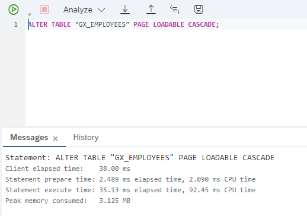

13. Refresh the contents of the runtime information tab for the **GX_EMPLOYEES** table again.

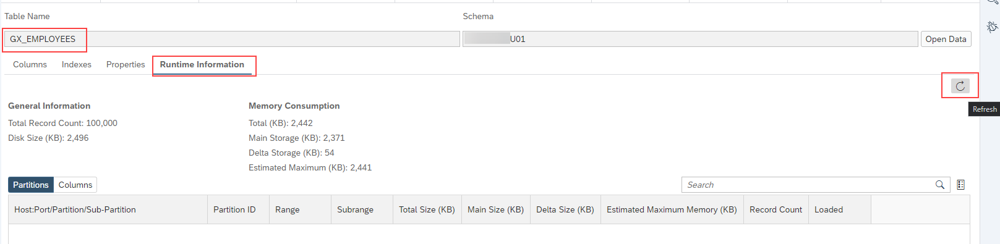

14. Observe that the amount of memory used by the table has significantly reduced after being moved to warm storage entirely:

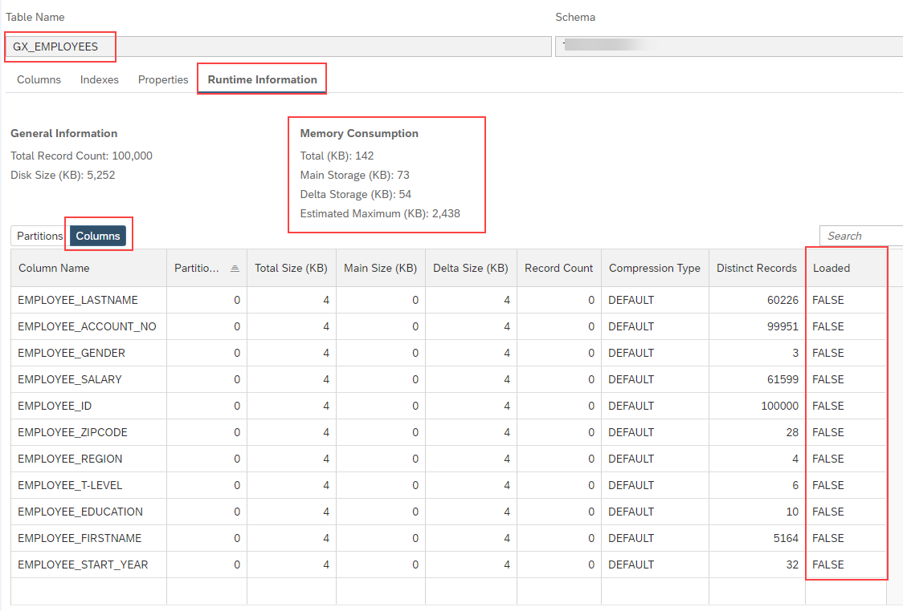

15. As the last step, make this table "hot" again by issuing the following command:

```SQL
LOAD "GX_EMPLOYEES" ALL;
```

16. Refresh the metadata screen for the **GX_EMPLOYEES** table to view the Runtime information again. The table is now back to its fully loaded state - no partitions and with hot "**in-memory**" access speed. Memory consumption is back to the initial state also.

>**Note:** The memory consumption of the table might might be larger or smaller than the figures shown in the image below - depending on whether the delta merge process has taken place by the time the screen is refreshed.

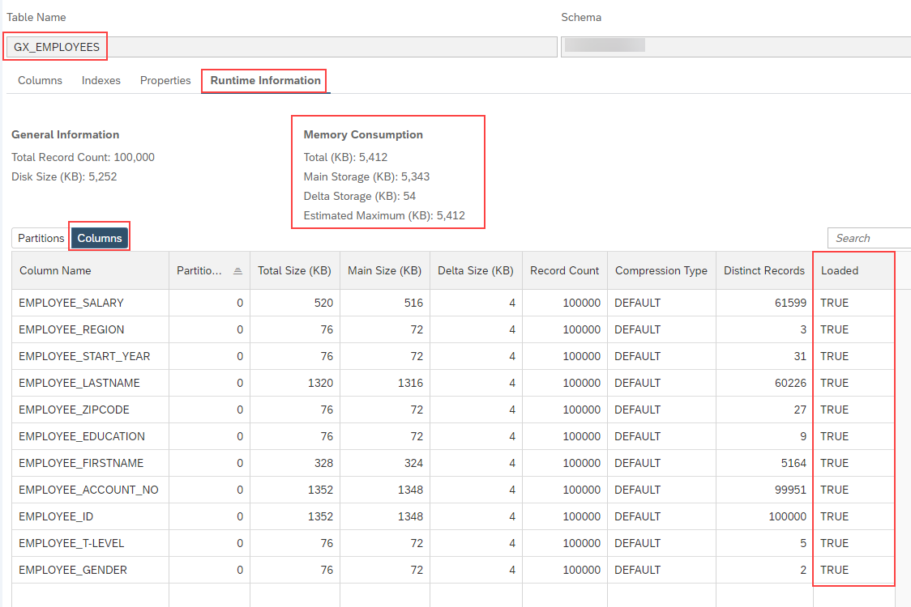


**Well done!!** This completes the lesson on scaling SAP HANA Cloud at low cost to accommodate large amounts of data with less time-criticality.

<!---You should now have an understanding of the concept of data temperatures in SAP HANA Cloud, and how you can move data between hot and warm storage using Native Storage Extension (NSE).--->


