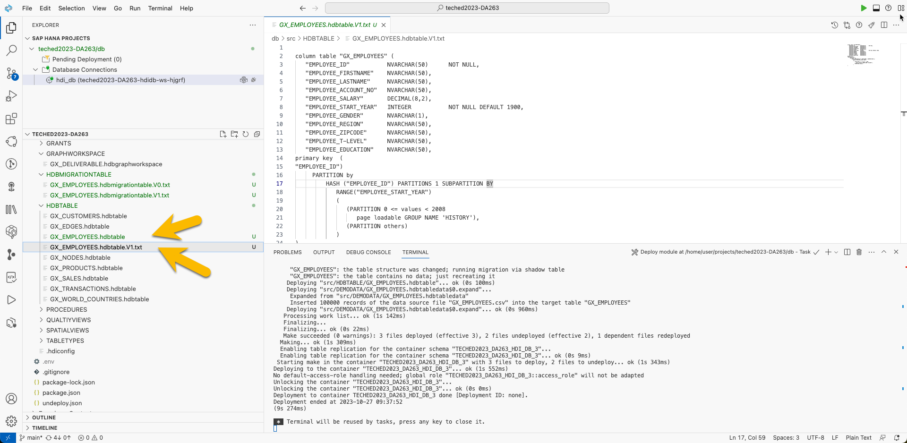
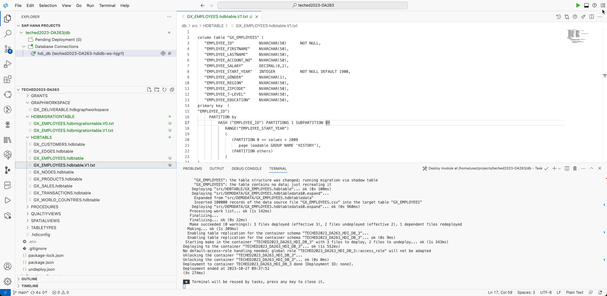

# DATA Tiering

The speed at which a business accesses its data varies based on many different conditions. SAP HANA Cloud provides the capability to use additional storage tiers other than memory to store data based on access speed and data density needs. SAP HANA Native Store Extension (NSE) is the disk storage option for use with data less frequently accessed than in memory. Memory is still utilized but only for the data that is being used. The SAP HANA data lake also offers high density storage at capacities far greater than possible using the other storage tiers.


Let's look at SAP HANA Cloud NSE in more detail, with some practical examples to enhance the understanding.

## SAP HANA Native Storage Extension


This image shows the difference between standard HANA in-memory storage and the storage offered with NSE:


The SAP HANA Native Storage Extension (NSE) feature for warm data storage is enabled by default in SAP HANA Cloud. Database developers may choose to assign specific tables, columns, or partitions to use NSE. SAP HANA NSE uses a dedicated in-memory buffer cache to load and unload pages of tables, table partitions or table columns.

>**Note:** The NSE feature in SAP HANA Cloud does not require modification to applications.

------

### Try it out

The following exercise demonstrates how to enable Native Storage Extension for a table and leverage its advantages in managing warm data.

This example uses the **GX_EMPLOYEES** columnar table containing 100,000 records, with its default persistency "in-memory" (hot).

1. Open the Database Explorer, and expand **Tables** and find the **GX_EMPLOYEES** table.


***open GX_EMPLOYEES***

2. Click on the table to open the meta data screen.


3. Select the **Runtime Information** tab to view record count and memory consumption.


To free up memory, this table will be partitioned and some data will move to the NSE warm storage tier.


4. This is done by partitions. If a partition is ***"PAGE LOADABLE"*** it is send to NSE storage. For the sample we choose START_YEAR. Only to show the principle of NSE. From a business perspective this may not make sense.

```sql
column table "GX_EMPLOYEES" (
   "EMPLOYEE_ID"           NVARCHAR(50)      NOT NULL,
   "EMPLOYEE_FIRSTNAME"    NVARCHAR(50),
   "EMPLOYEE_LASTNAME"     NVARCHAR(50),
   "EMPLOYEE_ACCOUNT_NO"   NVARCHAR(50),
   "EMPLOYEE_SALARY"       DECIMAL(8,2),
   "EMPLOYEE_START_YEAR"   INTEGER           NOT NULL DEFAULT 1900,
   "EMPLOYEE_GENDER"       NVARCHAR(1),
   "EMPLOYEE_REGION"       NVARCHAR(50),
   "EMPLOYEE_ZIPCODE"      NVARCHAR(50),
   "EMPLOYEE_T-LEVEL"      NVARCHAR(50),
   "EMPLOYEE_EDUCATION"    NVARCHAR(50),
   primary key  ("EMPLOYEE_ID")
   
      ) 
      PARTITION by 
         HASH ("EMPLOYEE_ID") PARTITIONS 1 SUBPARTITION BY
            RANGE("EMPLOYEE_START_YEAR")
            (
               (PARTITION 0 <= values < 2008 
                  page loadable GROUP NAME 'HISTORY'),
               (PARTITION others)
            )

```

To run this change we have prepared a GX_EMPLOYEES.hdbmigrationtable.
Rename both files before deploying again



- /db/src/HDBTABLE/GX_EMPLOYEES.hdbtable -> GX_EMPLOYEES.hdbtable.V0.txt
- /db/src/HDBTABLE/GX_EMPLOYEES.hdbtable.V1.txt -> GX_EMPLOYEES.hdbtable

This will change the table to be partitioned.
Deploy now



5. Refresh the **Runtime Information** tab for the GX_EMPLOYEES table


As you see the savings are with small datasets even negative. This should not irritate you here and you can for sure use this with larger datasets.

**Well done!!** This completes the lesson on scaling SAP HANA Cloud at low cost to accommodate large amounts of data with less time-criticality.
- Continue to - [Exercise 3 - MULTI-MODEL--SPATIAL](../9_3_HC_Spatial/6_DBX_Spatial.md)
- Continue to - [Main page](../../README.md)