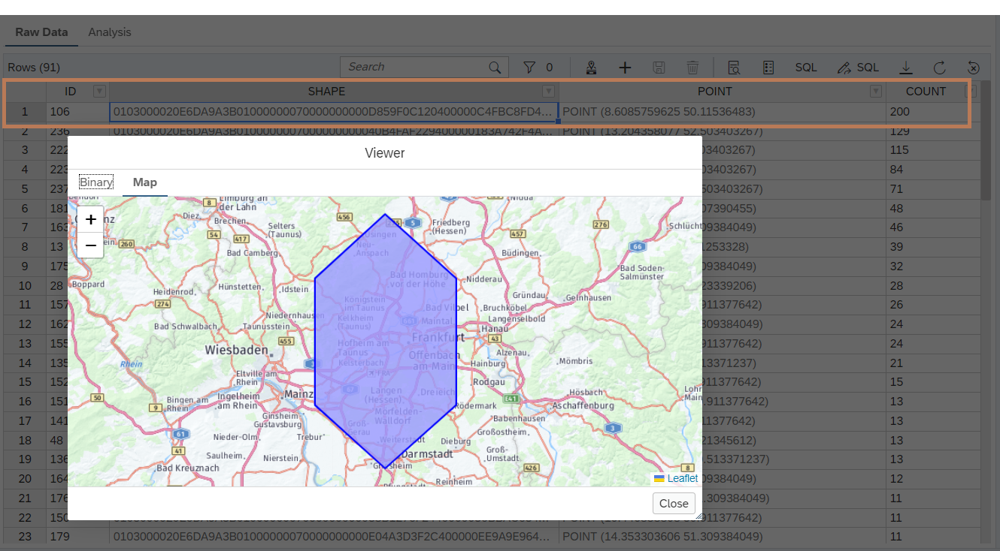

<!---In this section, a dataset containing location data will be utilized to demonstrate the spatial capabilities of SAP HANA Cloud. During the *Getting Started* lesson, a world map with countries as a table was loaded into the SAP HANA Cloud Database. This data resides in the **{placeholder|userid}** schema, in table **GX_WORLD_COUNTRIES**.--->

With SAP HANA Cloud’s spatial engine, application builders can add spatial intelligence to business data to gain deeper insights, identify new opportunities and discover root causes of complex issues.</br>

Some key features include:

</br>

- Native storage for 2D, 3D and 4D vector data types
- 100+ native, in-memory, geospatial functions that integrate into SQL
- Vector Tile integration
- Compliant with open standards for spatial data formats
- Esri-supported enterprise geodatabase
- Open-source plugins (GeoServer, QGIS)
- Python interface for data science</br>

<!------>


</br>

------
### Try it out!

</br>

**Viewing the State map**

This exercise uses the dataset from the **GX_WORLD_COUNTRIES** table to highlight borders of a country.

1. Switch to the SAP HANA Database Explorer. 

To display spatial data on a map, the default byte limit in the Database Explorer must first be increased.

2. Proceed as follows:
 
   - Switch to **Settings**.
   - Open the SQL Console tab.
   - Change the *Byte limit for Large Objects (LOBs)* to **1000024**.
   - Click **Save**.


3. Exit the settings and switch back to the Database Explorer. Select *Tables* and search for **GX_WORLD_COUNTRIES**.

4. Right-click on **GX_WORLD_COUNTRIES** and select **Open Data**.


</br>

5. Scroll down to Germany and double-click on the **SHAPE** entry or right-click and select **View Spatial Data**.


4. The map will appear:


</br>

## Viewing customers on the map


Now we want to display all customers from Germany. To do this, execute a database query and consider the points individually.

1. Click on the SQL Console icon to open a new SQL console, then copy the below SQL statement and click on **Run**.

```sql
SELECT * FROM GX_CUSTOMERS;
```

<!---</br>


--->
</br>


2. Notice the addresses already exist in the table as latitude and longitude. In order to use the map viewer, these numbers must be combined into a singular data type called **ST_POINT** using the *ST_POINT* function in SAP HANA Cloud. Paste the following SQL command into the console and execute it:

```sql
SELECT 
	CUSTOMER_ID,
	NEW ST_POINT(
		TO_DOUBLE(CUSTOMER_LONGITUDE), 
		TO_DOUBLE(CUSTOMER_LATITUDE), 
		1000004326
	) AS LOCATION
FROM "GX_CUSTOMERS";
```


3. Double-click on a **LOCATION** entry which will render a map displaying the customer location:


</br>

4. The next step is to create database sql view for ease of reuse by creating an artifacts as shown below.
Go to BAS project and click on SPATIAL VIEW folder and press F1 and type in 'hana database artifact'.


  Now click on 'Create SAP HANA Database Artifact' and fill in the details as shown below.
  
  **Please Note**: Path to create the artifacts should be as - ..../db/src/SPATIALVIEWS

  View name - VW_CUSTOMER_LOCATION and Click on Create.


5. Copy and paste the SQL statement below into the Console as shown below.

```sql 
VIEW "VW_CUSTOMER_LOCATION" AS
SELECT CUSTOMER_ID,
  NEW ST_POINT(
    TO_DOUBLE(CUSTOMER_LONGITUDE),
    TO_DOUBLE(CUSTOMER_LATITUDE),
    1000004326
  ) AS CUSTOMER_LOCATION
FROM "GX_CUSTOMERS";
```


  Now deploy this artifacts by clicking on Deploy Button (Rocket Icon).


>**Note:** Now go to Database Explorer and Click on "Views" in the Catalog and verify that the newly created view is listed.


</br>

## Viewing all customers on the map

Now it is possible to query all customer locations as a collection of points.

1. To display all customer locations at the same time, the points must be combined into a single object called a geometry collection. The following command gathers all the points from the database view for display by the map:
 
```sql
SELECT ST_CollectAggr(CUSTOMER_LOCATION) 
FROM "VW_CUSTOMER_LOCATION";
```
</br>

2. Double-click on the resulting output row, or right-click and select **View spatial data** the option on the result:


3. A map displaying all the customer locations appears:
 


</br>

## Separating customer addresses to a specific area

For this use case, reduce the set of customers to those only in Germany. Using the polygon from *GX_WORLD_COUNTRIES*, we can check which points are within are certain border. To further simplify processing, update the previously created view.

1. Switch back to BAS Artifact Console -'VW_CUSTOMER_LOCATION.hdbview', copy, paste and re-deploy the Artifact:

```sql
VIEW "VW_CUSTOMER_LOCATION" AS
SELECT CUSTOMER_ID,
  NEW ST_POINT(
    TO_DOUBLE(CUSTOMER_LONGITUDE),
    TO_DOUBLE(CUSTOMER_LATITUDE),
    1000004326
  ) AS CUSTOMER_LOCATION
FROM "GX_CUSTOMERS",
  "GX_WORLD_COUNTRIES"
WHERE "COUNTRY" = 'Germany'
  AND "SHAPE".ST_Contains(
    NEW ST_POINT(
      TO_DOUBLE(CUSTOMER_LONGITUDE),
      TO_DOUBLE(CUSTOMER_LATITUDE),
      1000004326
    )
  ) = 1;
```

<!------>

</br>

<!--  -->


2. Now execute the following statement to organize all customers in Germany as a collection bordered by the German border (the filter condition of the SQL View checks whether the locations are in Germany).

```sql
SELECT "SHAPE".ST_Collect(ST_CollectAggr(CUSTOMER_LOCATION))
FROM "VW_CUSTOMER_LOCATION",
"GX_WORLD_COUNTRIES"
WHERE "COUNTRY" = 'Germany';
```


3. Double-click on the result, or right-click and select **View spatial data** to view the resulting map:


</br>


## Clustering

Using spatial processing, view the clustering of all customer locations in Germany.

1. Switch back to BAS and create database sql view for ease of reuse by creating an artifacts as shown below.
Go to BAS project and click on SPATIAL VIEW folder and press F1 and type in 'hana database artifact'.


  Now click on 'Create SAP HANA Database Artifact' and fill in the details as shown below.

  View name - VW_SPATIAL_CLUSTERING and Click on Create.


Copy and paste the SQL statement below into the Console as shown below and Deploy the artifact.

```sql
VIEW "VW_SPATIAL_CLUSTERING" AS
SELECT ST_ClusterID() AS ID,
  ST_ClusterCell() AS SHAPE,
  ST_ClusterCell().ST_PointOnSurface().ST_AsText() AS POINT,
  COUNT(*) AS COUNT
FROM "VW_CUSTOMER_LOCATION" GROUP CLUSTER BY "CUSTOMER_LOCATION" USING HEXAGON X CELLS 20
ORDER BY COUNT DESC;
```


2. Check under the *Views* area of the Catalog to verify that the View is visible.


Now look at the cluster result from different views.

3. In Database Explorer, right-click on the **VW_SPATIAL_CLUSTERING** view and select **Open Data**.


</br>

4. Look at the largest hexagon with **200** entries by double-clicking the **SHAPE** entry. The result for the highest customer density is in an area around Frankfurt:



</br>

# Further information

- [SAP HANA Cloud, SAP HANA Database Spatial Reference](https://help.sap.com/docs/HANA_CLOUD_DATABASE/bc9e455fe75541b8a248b4c09b086cf5/e1c934157bd14021a3b43b5822b2cbe9.html)


- Continue to - [Exercise 4 - MULTI-MODEL--DOCUMENTSTORE](../9_4_HC_DocumentStore/README.md)
- Continue to - [Main page](../../README.md)