**SAP HANA Cloud Document Store**

SAP HANA Cloud Document Store provides the ability to manage complex business data in its native structure with full flexibility and simplified integration options. 

Some of the features include:

- Native support for JSON documents
- Full schema flexibility
- Dedicated storage with the processing power of an in-memory database
- Support for operations on JSON documents through SQL
- Integration with the data structures of common programming languages

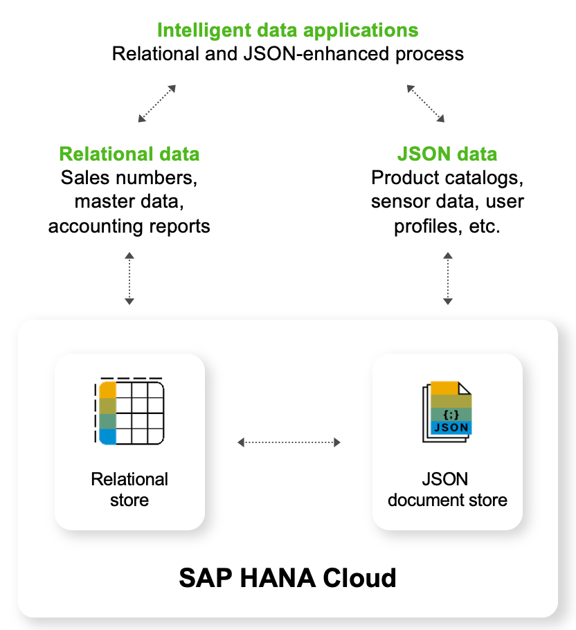


------
### Try it out! 

Switch to the Database Explorer to work through the following exercises which use the dataset from table **GX_REVIEW**

1. Select the catalog object **JSON Collections** to display the list of Collections.

2. Right-click on the collection **GX_REVIEW**.

3. Click on **Generate SELECT Statement**.

>**Note:** SAP HANA Cloud uses the same SQL to access collections as column and row tables.

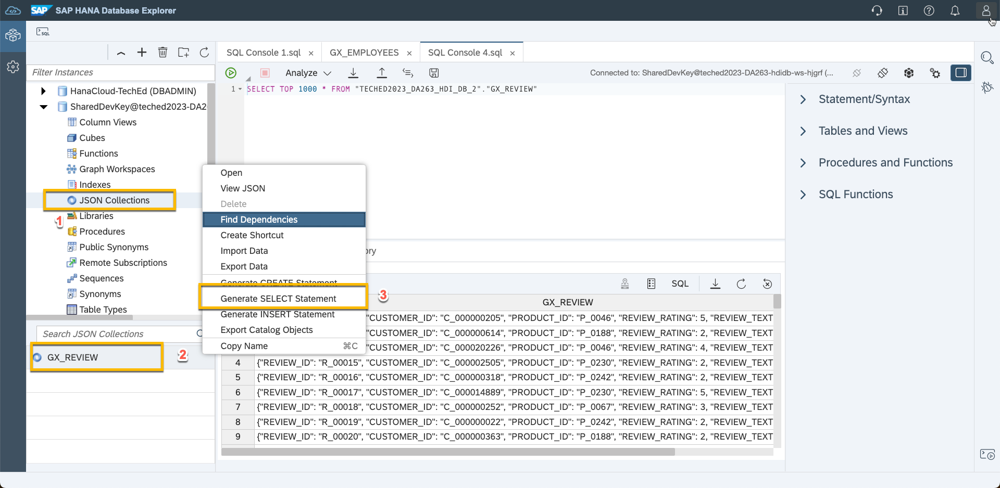

4. Execute the provided statement in the resulting SQL console.

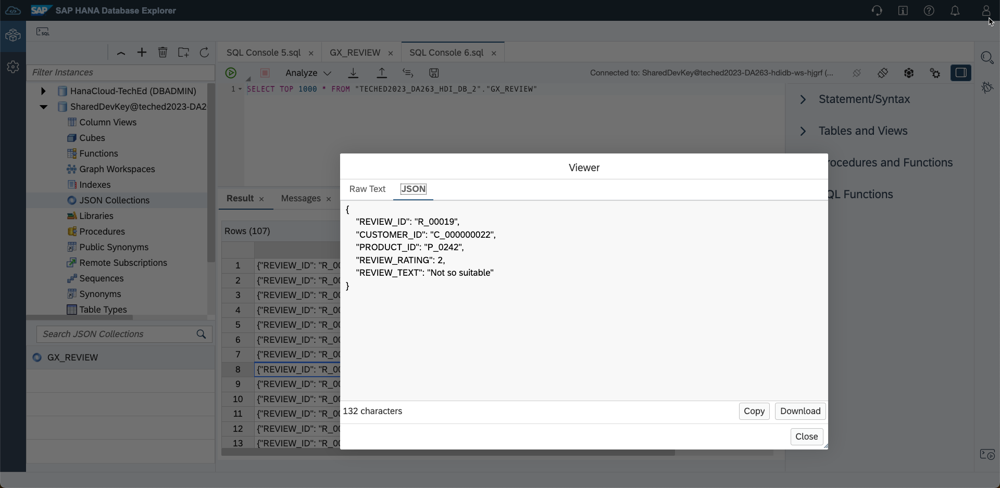

5. Add a filter clause to the query by running the following statement.

```sql
SELECT * FROM GX_REVIEW 
 WHERE REVIEW_ID='R_00012';
 ```

6. The result is in a JSON string:

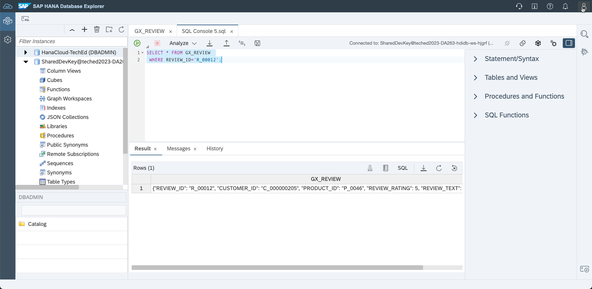


7. Specify each of the columns in the SQL statement to see the result in a relational format

```sql
SELECT 
	REVIEW_ID,
	CUSTOMER_ID,
	PRODUCT_ID,
	REVIEW_RATING,
	REVIEW_TEXT 
FROM 
	GX_REVIEW 
WHERE 
	REVIEW_ID='R_00012';
```

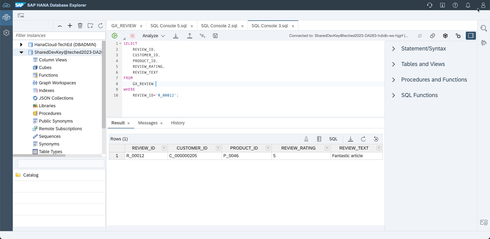

8. Insert a new JSON Object to the collection.

```sql
INSERT INTO "GX_REVIEW" 
       VALUES('{"REVIEW_ID":"R_100123",
       "CUSTOMER_ID":"C_000000205",
       "PRODUCT_ID":"P_0046",
       "REVIEW_RATING":5,
       "REVIEW_TEXT":"Absolutely perfect"}'
       );
```

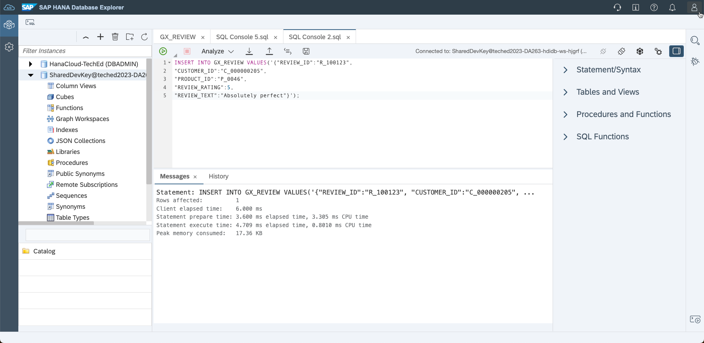


9. Query the collection to look for the new entry.

```sql
SELECT * FROM GX_REVIEW WHERE REVIEW_ID='R_100123';
```

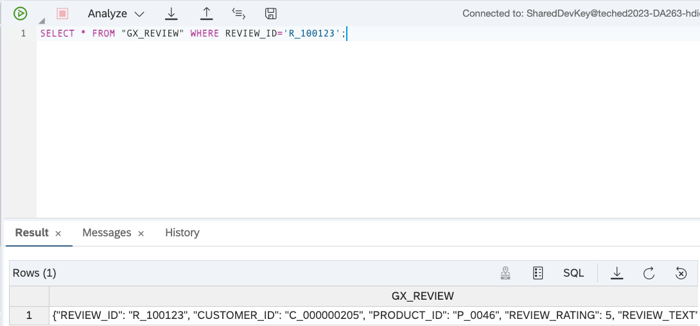

10. Update the inserted entry and query the entry.

```sql
UPDATE GX_REVIEW 
	SET REVIEW_TEXT='Hello again' 
		WHERE REVIEW_ID='R_100123';
SELECT * FROM GX_REVIEW 
	WHERE REVIEW_ID='R_100123';
```

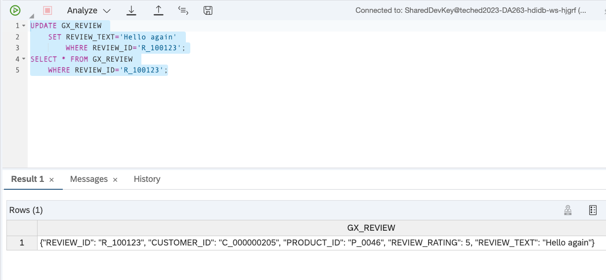

11. Aggregate the JSON Objects

```sql
SELECT PRODUCT_ID,AVG(TO_BIGINT(REVIEW_RATING)) FROM "GX_REVIEWS" GROUP BY PRODUCT_ID ORDER BY PRODUCT_ID ASC;
```

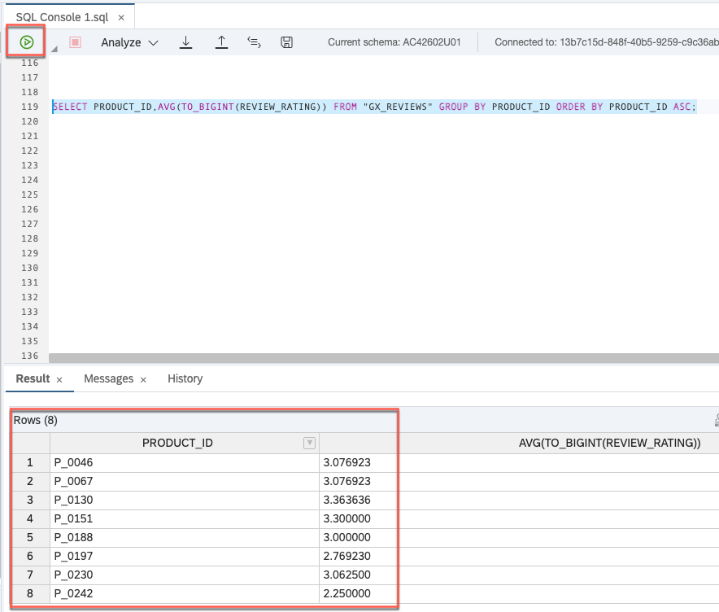

<br>

12. The JSON data in the document store can easily combine with business data.
   
```sql
WITH myView AS (SELECT PRODUCT_ID as PID,AVG(TO_BIGINT(REVIEW_RATING)) as AVGRATING FROM "GX_REVIEWS" GROUP BY PRODUCT_ID )
       SELECT PID,PRODUCT_NAME,AVGRATING FROM myView INNER JOIN "GX_PRODUCTS"
       ON myView.PID = PRODUCT_ID;
```

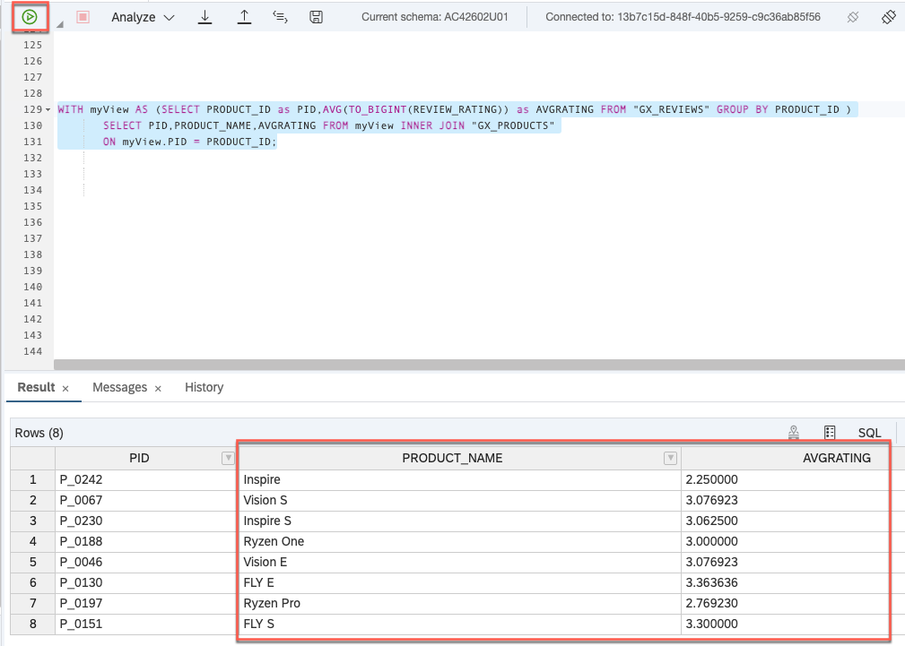


</br>


13. Finally, join Reviews with Customer and Product data to add more context:


```sql
create view myView 
AS 
SELECT PRODUCT_ID PID, CUSTOMER_ID,PRODUCT_NAME, REVIEW_RATING,REVIEW_TEXT FROM GX_REVIEWS; 
(SELECT PID,P.PRODUCT_NAME, CUSTOMER_ID,REVIEW_RATING FROM myView INNER JOIN GX_PRODUCTS AS P
ON myView.PID = P.PRODUCT_ID);
```

14. Now add in the customer details and review text:

```sql
select distinct PR.PID,PR.CUSTOMER_FIRSTNAME,GP.PRODUCT_NAME, PR.REVIEW_RATING, PR.REVIEW_TEXT 
from (
select * 
from MYVIEW RE, GX_CUSTOMERS GC
where RE.CUSTOMER_ID = GC.CUSTOMER_ID) PR, GX_PRODUCTS GP
where PR.PID = GP.PRODUCT_ID;
```

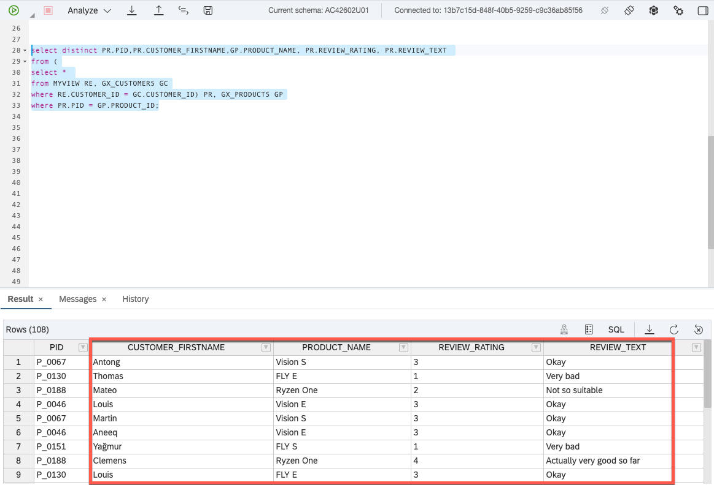

</br>

**Well done!!** This completes the lesson on the SAP HANA Cloud Document Store.
For further information on this topic, check out the following link:</br>

- [SAP HANA Cloud, SAP HANA Database JSON Document Store Guide](https://help.sap.com/docs/HANA_CLOUD_DATABASE/f2d68919a1ad437fac08cc7d1584ff56/dca379e9c94940e998d9d4b5c656d1bd.html)