Graphs can model different kinds of networks and linked data coming from many industries, such as logistics and transportation, utility networks, knowledge representation, and text processing.

A graph is made up of a set of **vertices** and a set of **edges**. Vertices are the *entities* in the graph while the edges describe the *relationships* between vertices. 

Each edge connects two vertices - one vertex is denoted as the source and the other as the target. Edges are always directed, but they can be oriented in either direction.

The SAP HANA Cloud Graph Engine applies the use of edges and vertices to analyze complex relationships in business data and processes to boost performance and business understanding. </br>
</br>
Key features include:</br>

- Graph data processing that enhances relational business data, enabling work analysis
- Built-in graph scripting language
- SAP-delivered graph algorithms that accelerate the development of new applications
- Direct integration into SQL layer and database procedures
- Pattern-matching support for openCypher query language
- Python client for data science

</br>

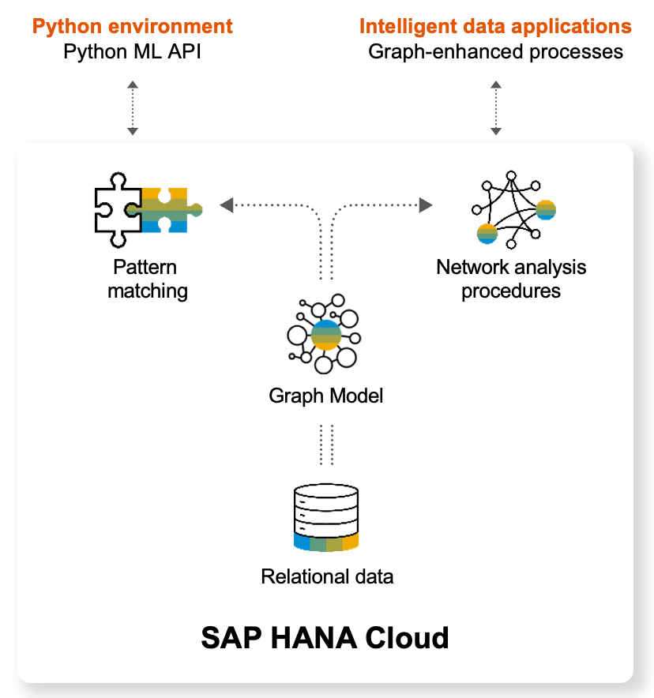

</br>

------
### Try it out!

</br>

Explore the SAP HANA Cloud Graph engine with the following exercise which uses the dataset from table **GX_REVIEWS** in the local **{placeholder|userid}** schema.

## Create a Graph Workspace

1. In the Database Explorer, expand the Catalog and select the object **Graph Workspaces**.

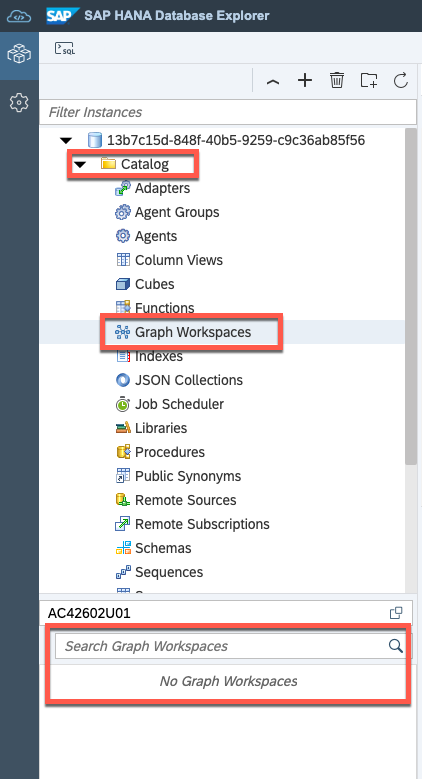

<!--
2. Use the Database Explorer SQL Console to create table constraints by running the following statements:

```sql
ALTER TABLE "GX_EDGES"
ADD FOREIGN KEY ("start") REFERENCES "GX_NODES" ("node_id") ON UPDATE CASCADE ON DELETE CASCADE ENFORCED VALIDATED;

ALTER TABLE "GX_EDGES"
ADD FOREIGN KEY ("end") REFERENCES "GX_NODES" ("node_id") ON UPDATE CASCADE ON DELETE CASCADE ENFORCED VALIDATED;
```

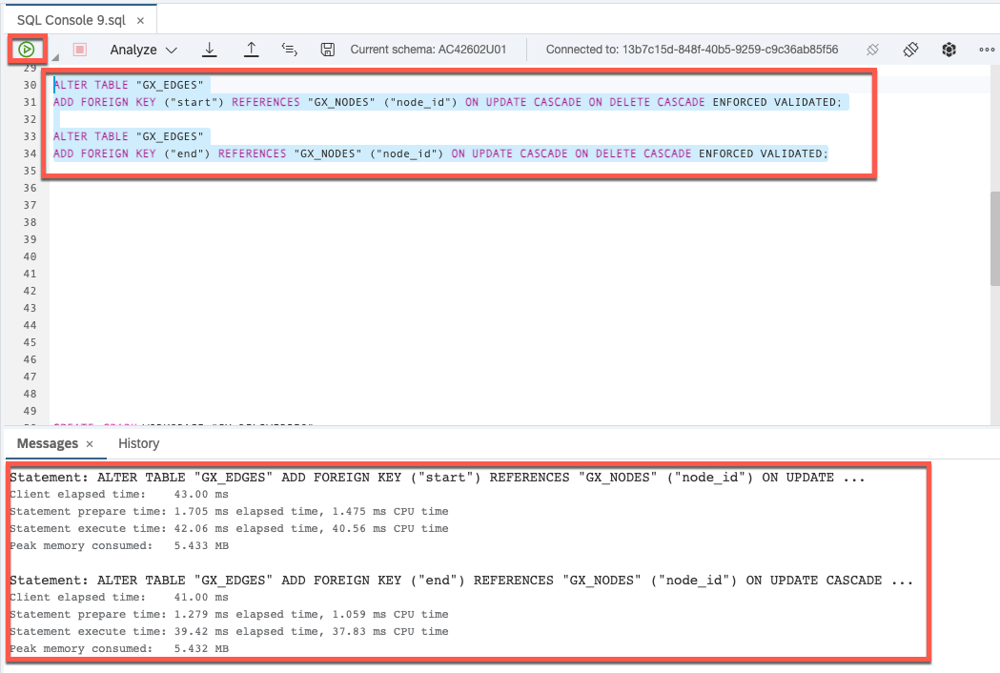
-->

2. Now go to the BAS project and under db/src folder create a subfolder named **GRAPHWORKSPACE**.
Right click on the folder and create a new file.Name it  **GX_DELIVERABLE.hdbgraphworkspace** and copy below code in the code editor

```sql
GRAPH WORKSPACE "GX_DELIVERABLE"
EDGE TABLE "GX_EDGES" 
	SOURCE COLUMN "start" 
	TARGET COLUMN "end" 
	KEY COLUMN "edge_id" 
VERTEX TABLE "GX_NODES" 
	KEY COLUMN "node_id" ;
```
</br>

Look for the deploy button as highlighted in screen below.
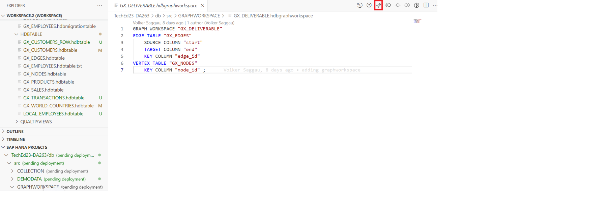
Now Click on deploy button.Wait for the deployment to finish.

3. Once deployment is successfully completed, we can now explore the *GX_DELIVERABLE* graph.
To explore the graph,go to Database Explorer.Select **GX_DELIVERABLE** in the catalog object **Graph Workspaces**, then right-click on it and select **View Graph**.

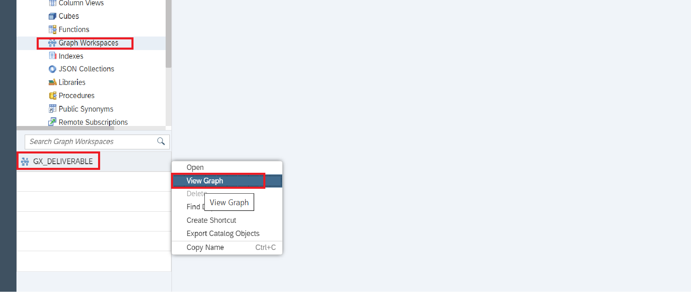

4. The graph is displayed as below:

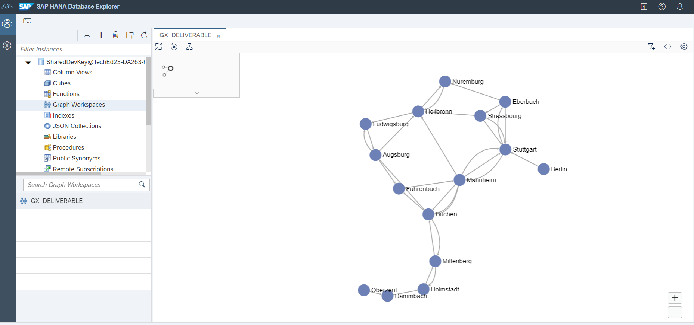

> **Note:** The **Vertices** (nodes) represent all delivery locations.

Analysis of the graph can be augmented by adding context such as labels and color schemes to highlight relationships.
The following steps will change the color of the Vertices (Nodes) for priority deliveries to red.

5. Click on the **Settings** icon in the top right corner to open a configuration menu for the graph. 

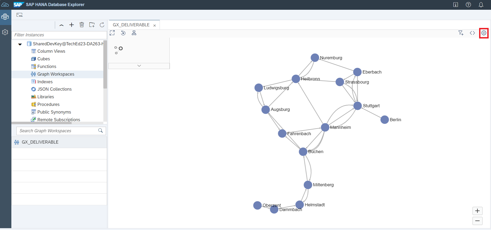

6. On the **Vertex** tab, under *Highlight Vertex*, set the following values to highlight the cities with priority delivery orders to red:

- Column: **priority**
- Value: **TRUE**
- Color: **Red**

7. Click on **Apply** to see the changes on the graph.

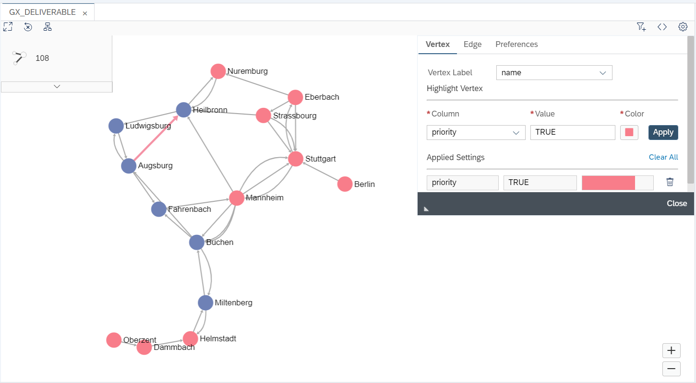


It's also possible to use this method to change the *Edge* settings on the graph.
Alter the Edge configuration to display the delivery method and highlight any **drone** deliveries to red also.

8. In the graph settings menu, select the **Edge** tab and make the following changes:

- Edge Label: **method**
- Column: **method**
- Value: **drone**
- Color: **Red**

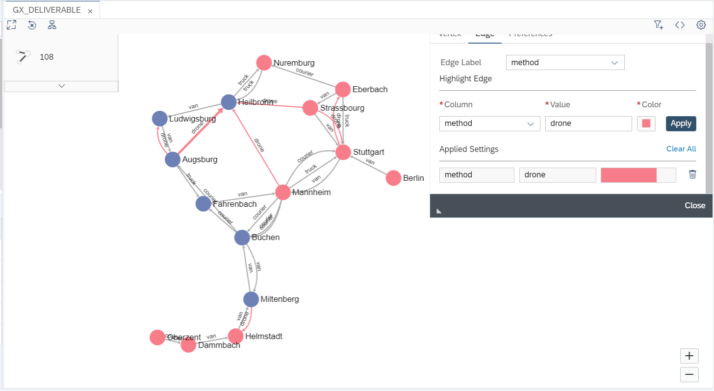

9. Click on **Apply** and then **Close** to return to the graph.

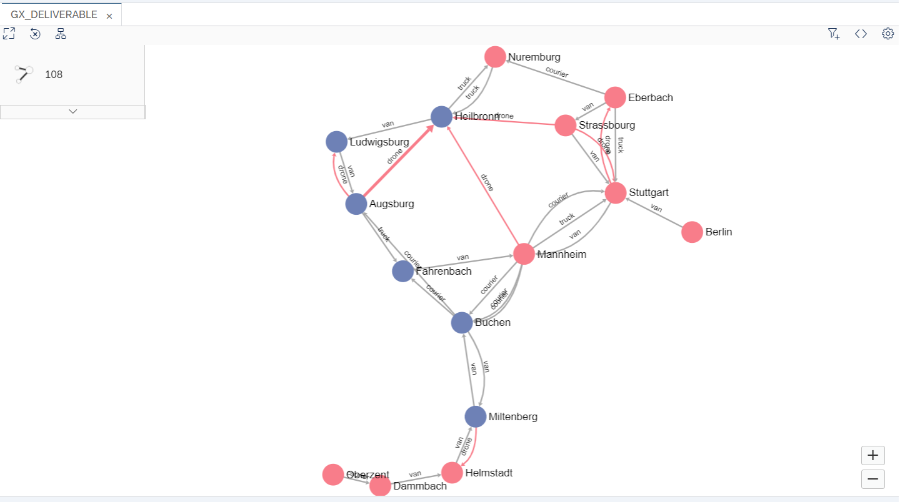

</br>

> As can be seen on the graph, delivery method edges of type **drone** are now highlighted in red where applicable.

</br>


## Explore Graph algorithms

SAP HANA Cloud Graph provides a new graph calculation node that can be used in calculation scenarios.

This node executes one of the available actions on the given graph workspace and provides the result as table output.

Calculation scenarios can be created with plain SQL as shown in the following section, or with tools such as the SAP HANA Modeler or the native SAP HANA Cloud Graph Viewer.
</br>

------
### Try it out!

Calculate the shortest path from one point to another in the graph using the built-in **Shortest Path** algorithm.

1. Click on the **Algorithms** icon beside the settings icon to open the algorithms dialog menu.

2. In the Algorithm drop down option, select **Shortest Path**.

3. Enter the following values as the inputs to the algorithm:

- Start Vertex: **Miltenberg**
- End Vertex: **Nuremburg**
- Direction: **Outgoing**
- Weight Column: **length**

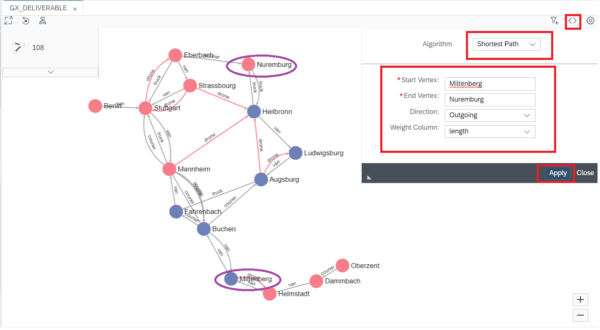

4. Click on apply to see the result:

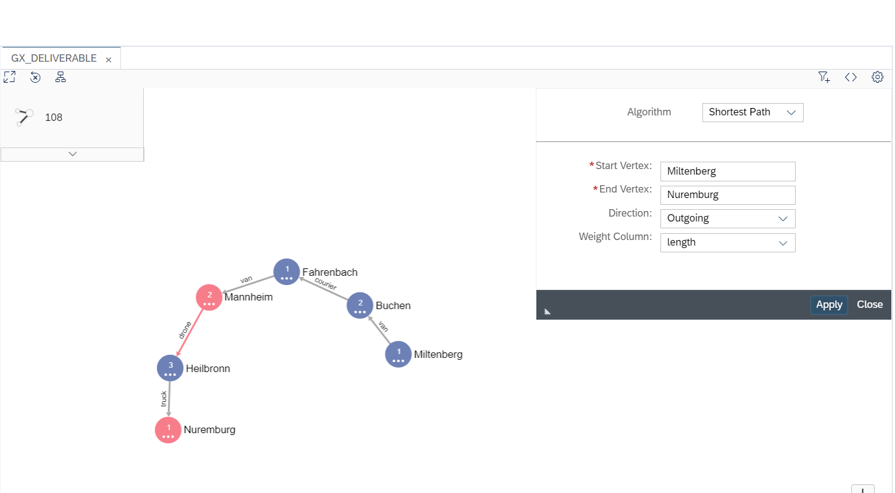

<br>

Find all nodes which are related to a particular node with the **Neighborhood** algorithm. The parameters for this algorithm include depth of search, and whether to search for incoming or outgoing edges. Let's see what other nodes are related to the Mannheim vertex.


5. Reset the Graph.Click on **Reset Graph** button.

6. In the Algorithm drop-down box, select **Neighborhood**.

7. Enter the following values as inputs:

- Start Vertex: **Mannheim**
- Direction: **Incoming**
- Min Depth: **0**
- Max Depth: **1**


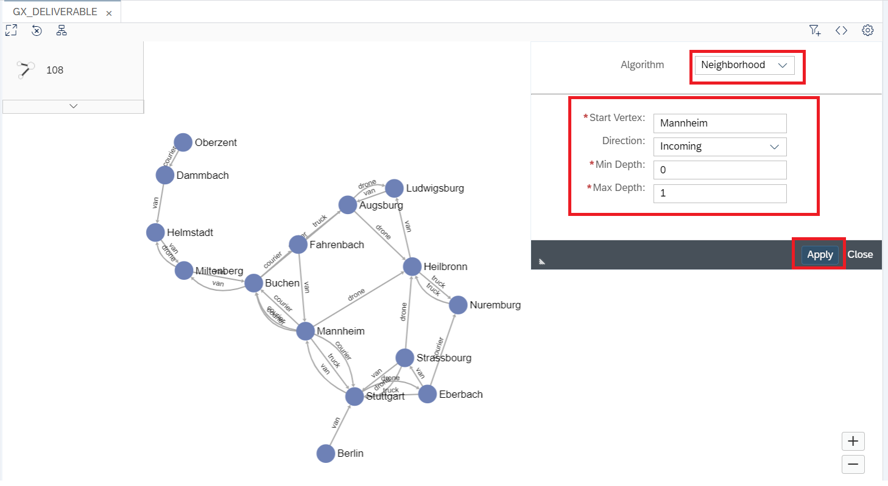

8. Click on **Apply** to see the resulting graph.

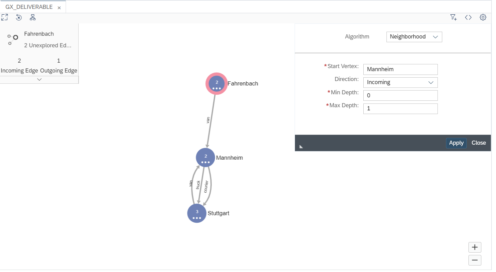

</br>

## Algorithms Using GraphScript

GraphScript is a high-level, powerful, domain-specific language. GraphScript eases the development and integration of complex graph algorithms.
</br>

------
### Try it out!

1. Call the **Nearest-Neighbor** built-in algorithm from GraphScript. 
Go to BAS and under db/src/TABLETYPES/GRAPH, create a new file named **TT_NODES.hdbtabletype**
Paste below code in the editor and deploy


```sql
TYPE "TT_NODES" AS TABLE ("node_id" NVARCHAR(50), "name" NVARCHAR(50));
```

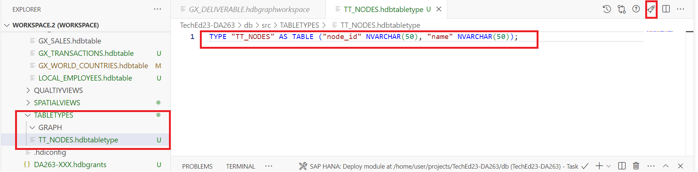

2. Under db/src/PROCEDURES/GRAPH ,create a new file named **SP_NHOOD.hdbprocedure** and paste below code in the editor and deploy
```sql
PROCEDURE "SP_NHOOD"(
	IN startV NVARCHAR(50),
	IN minDepth INTEGER,
	IN maxDepth INTEGER,
	OUT res "TT_NODES")
LANGUAGE GRAPH READS SQL DATA AS
BEGIN
  GRAPH g = Graph("GX_DELIVERABLE");
  VERTEX v_s = Vertex(:g, :startV);
  MULTISET<VERTEX> ms_n = Neighbors(:g, :v_s, :minDepth, :maxDepth);
  res = SELECT :v."node_id", :v."name" FOREACH v IN :ms_n;
END

```
</br>

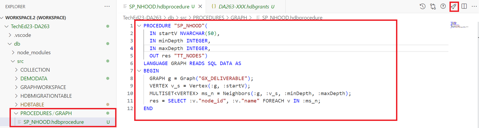


3. Now go to Database Explorer and call the procedure **SP_NHOOD** with different parameters to check results.

```sql
CALL "SP_NHOOD"('Berlin', 0, 2, ?);
```

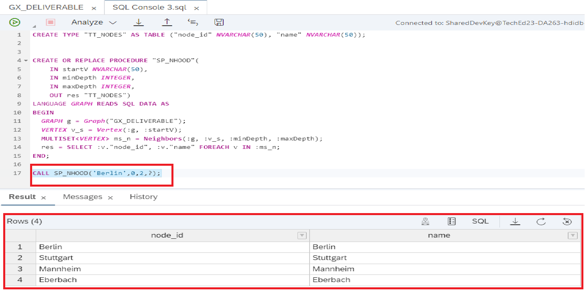

</br>

Use GraphScript to create a custom traverse algorithm.

4. Go to BAS and under db/src/TABLETYPES/GRAPH, create a new file named **TT_PRIORITY.hdbtabletype**
Paste below code in the editor and deploy. 

```sql
TYPE "TT_PRIORITY" AS TABLE ("node_id" NVARCHAR(50), "distance" INTEGER, "hops" BIGINT);

```
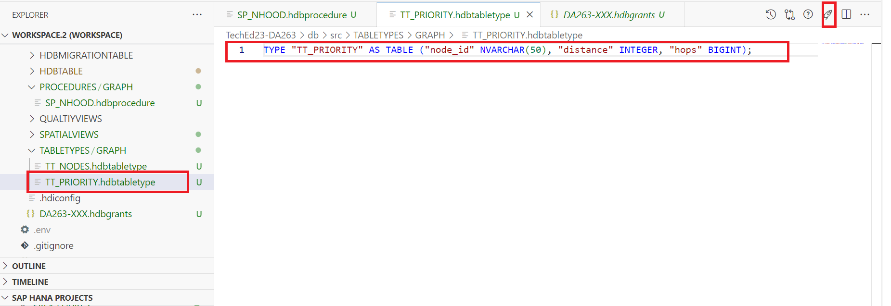
</br>

5. Create a new file named **SP_PRIORITY.hdbprocedure** under db/src/PROCEDURES/GRAPH and paste below content.It creates a procedure to calculate **Shortest-Path** distances to cities with high priority status.Deploy the artifact.

```sql
PROCEDURE "SP_PRIORITY"(IN startV NVARCHAR(50), OUT res "TT_PRIORITY")
LANGUAGE GRAPH READS SQL DATA AS
BEGIN
	GRAPH g = Graph("GX_DELIVERABLE");
	VERTEX v_s = Vertex(:g, :startV);
	MULTISET<Vertex> rests = v IN Vertices(:g) WHERE :v."IN_SCOPE" == 1;
	ALTER g ADD TEMPORARY VERTEX ATTRIBUTE (INT "distance" = 0);
	ALTER g ADD TEMPORARY VERTEX ATTRIBUTE (BIGINT "hops" = 0L);
	FOREACH rest in :rests {
		VERTEX v_rest = Vertex(:g, :rest."node_id");
		WeightedPath<INT> p = Shortest_Path(:g, :v_s, :v_rest, (Edge conn) => INTEGER { return :conn."length"; } );
		rest."hops" = Length(:p);
		rest."distance" = Weight(:p);
	}
	res = SELECT :v."node_id", :v."distance", :v."hops" FOREACH v IN :rests;
END
```
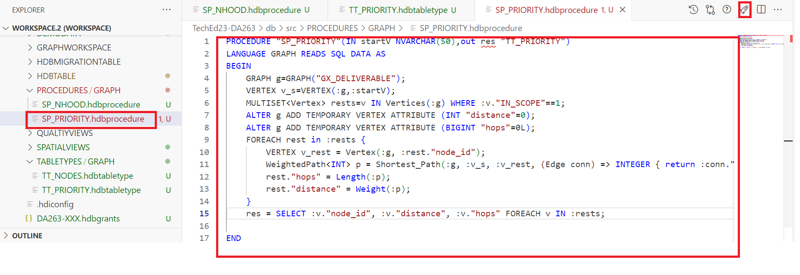
</br>

6. Now go to Database Explorer and call the procedure **SP_PRIORITY** with different parameters to check results.
</br>

7. Above code once deployed creates **SP_PRIORITY** object in Procedures. Right-click on the procedure name and select **Generate CALL Statement With UI**.

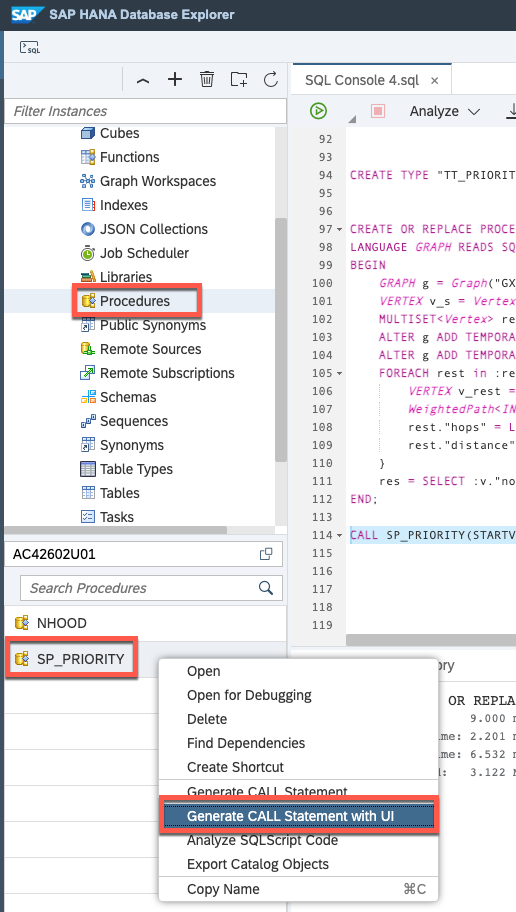

8. The procedure's call statement is generated. Provide input value **Berlin** and click Run.

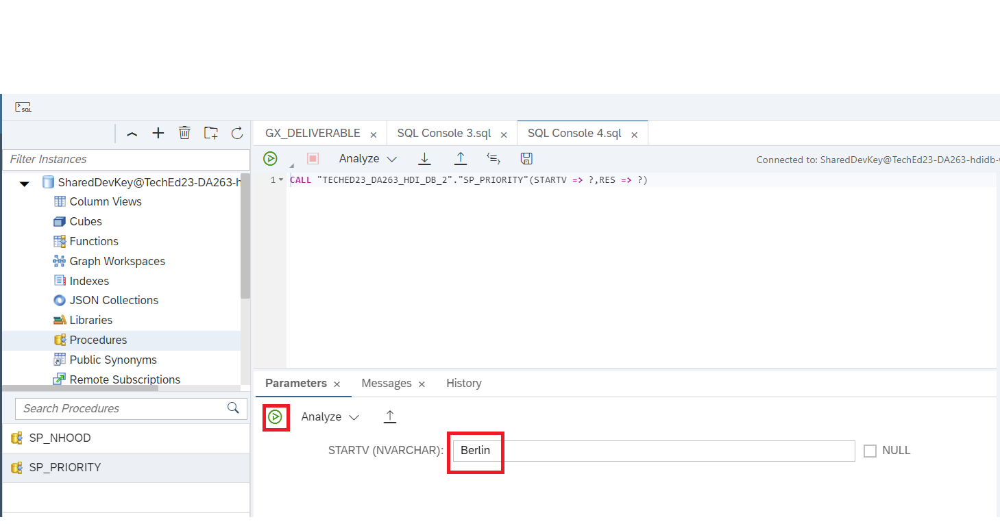

The result of the GraphScript is the shortest distance in meters to each city plus the number of hops to get there.


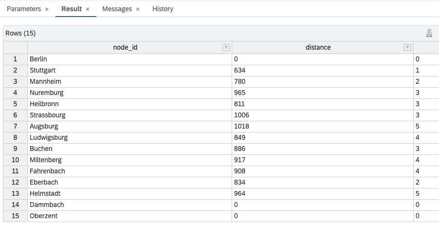


</br>


## Pattern Matching Using OpenCypher in SQL

Application builders can also apply pattern matching to their solutions. **OpenCypher** is a declarative graph query language for graph pattern matching developed by the OpenCypher Implementers Group.

Use OpenCypher directly within a SQL statement:</br>

1. Run the following query from the SQL console:

```sql
SELECT * FROM OPENCYPHER_TABLE( GRAPH WORKSPACE "GX_DELIVERABLE" QUERY
    '
    MATCH (point1)
    WHERE point1.fragile = ''TRUE''
    RETURN point1.node_id as destination, point1.fragile as fragile_deliveries
    '
) ORDER BY "destination";
```

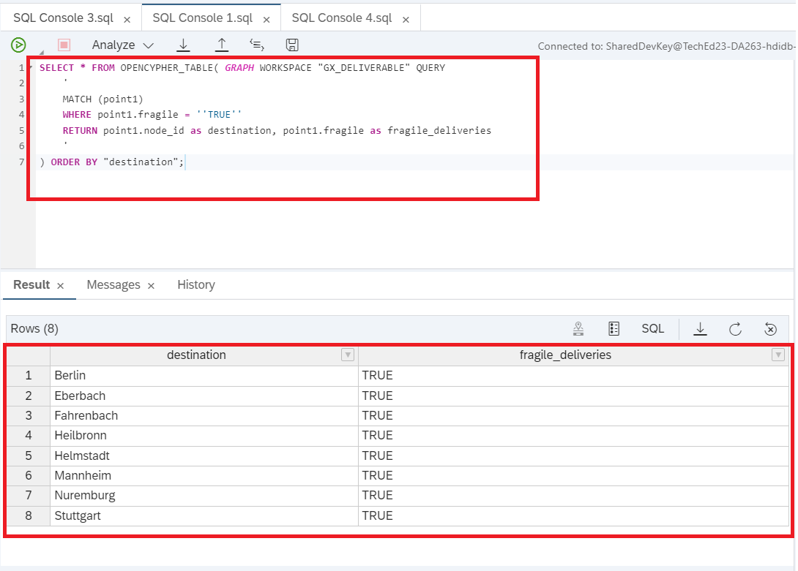

>**Note:** Only matched nodes with **'fragile' = 'TRUE'** have been selected.


2. Select only edges (or relationships in Cypher terminology) from a city with a high priority to a valid city.

```sql
SELECT * FROM OPENCYPHER_TABLE( GRAPH WORKSPACE GX_DELIVERABLE QUERY
    '
	MATCH (point1)-[conn]->(point2)
	WHERE point1.IN_SCOPE = 1 AND point2.priority = ''TRUE''
	RETURN point1.node_id as delivery_start, conn.length as distance, conn.mode as delivery_type, point2.node_id as delivery_end
    '
) ORDER BY "delivery_start";
```

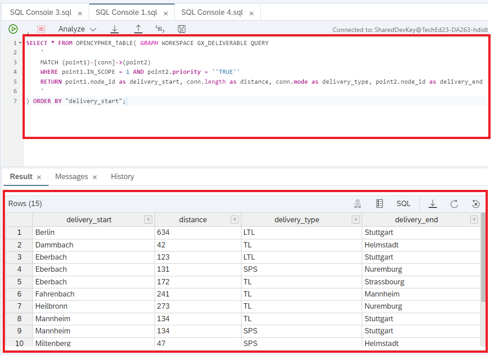

**Further Reading**

- [SAP HANA Cloud, SAP HANA Database Graph](https://help.sap.com/docs/hana-cloud-database/sap-hana-cloud-sap-hana-database-graph-reference/sap-hana-cloud-sap-hana-database-graph-reference?locale=en-US)

**Well done!** This completes the lesson on the SAP HANA Cloud Graph Engine. For further information on this topic, check out the following link.

- Continue to - [Exercise 6 - AUTOML](../9_6_HC_AutoML/9_AutoML.md)
- Continue to - [Main page](../../README.md)
