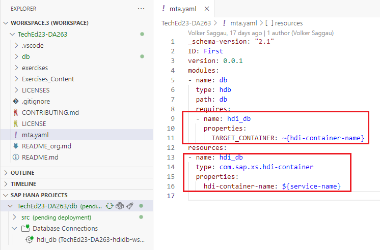
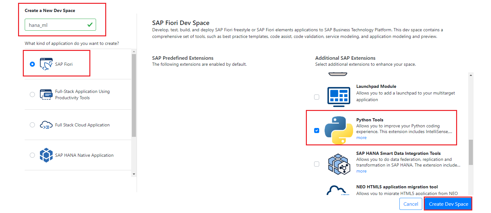

# Automated Machine Learning (AutoML)

SAP HANA Cloud is enriched with an Automated Machine Learning (AutoML) approach. AutoML can be helpful, for example, to give a data scientist a head-start into quickly finding a first machine learning model.

A machine learning model is a program that can find patterns or make decisions from a previously unseen dataset. This is made possible by first 'training' the model with a large dataset.
During training, the machine learning algorithm is optimized to find certain patterns or outputs from the dataset, depending on the task. The output of this process - often a computer program with specific rules and data structures - is called a *machine learning model*.

AutoML with SAP HANA Cloud is a great starting point to see what is possible with a dataset, and if it is worth to invest more time into a use case.

### Unique benefits with PAL (Predictive Analytics Library) AutoML Includes:

- Improved PAL models and business impact 
- Composite pipeline models of multiple PAL algorithms
- Automated algorithm comparison and selection as well as parameter search and optimal selection ML predictions of higher accuracy/value

### Productivity up-lift and expert experience

- Expert Data Scientists derive best models in less time/better utilization of compute time to derive best models
- Comparable AutoML expert experience and address trending/competitive capability gap and improve time to maximum value with PAL

</br>

 

For this section, a data set containing customer transactions as a table has already been loaded into the SAP HANA Cloud Database (**GX_TRANSACTIONS**). 

The challenge is to predict whether a transaction is fraudulent or not. Such use cases are often quite challenging due to imbalanced data and thus require different techniques before implementing a machine learning model.

------
### Try it out!

Start this lesson by downloading the following zipped [JupyterLab NoteBook](./Files/FraudDetection_AutoML.ipynb.zip). Save the file locally and extract the notebook file. This file will be uploaded into the Jupyter environment later in the exercise.</br>

The data resides in the HDI container schema, in table **GX_TRANSACTIONS**. Data is accessed from the Python environment directly in SAP HANA Cloud, and will leverage the native Auto Machine Learning capability in SAP HANA Cloud.

All steps in this exercise will be based on the embedded Python code in the Notebook.

### Setting up the environment

1. To execute PAL and AutoML methods , the HDI container's application user (XXX_RT) needs to be assigned either the role *AFL__SYS_AFL_AFLPAL_EXECUTE* or *AFL__SYS_AFL_AFLPAL_EXECUTE_WITH_GRANT_OPTION*

2. We will grant the required roles to the HDI container's application user by creating a User Provided Service and *.hdbgrants* artifact.

3.Open Business Application Studio and click on **mta.yaml** in your project to view it. Observe that in the *requires* section of db module and *resources* section, there is a reference to the SAP HANA HDI service instance that is bound to the application



3. Go to the SAP HANA PROJECTS view and click on **add database connection** as shown below


4. If you are prompted with *Cloud Floundry Sign In*, proceed by selecting SSO passcode and clicking on the *Open a new browser page to generate your SSO passcode* as shown in step 6 of [this guide](../9_0_HC_Intro/1_BAS_Getting_Started.md#cloning-our-project-from-git). Skip to next step if *Cloud Floundry Sign In* is not prompted.

5. In the **Add Database Connection** wizard, select *Create user-provided service instance from the drop-down.


6. Enter the following details and click **ADD**

```
Service instance name : DA263-XXX (replace XXX with your user login number)

user name : HDI_ML_GRANTOR 

password : Walldorf11 

```


7. Check the *mta.yaml* file. Additional references to the created User Provided Service will be added automatically.


8. Open the generated *DA263-XXX.hdbgrants* file and replace its content with below.


```sql
{
    "ServiceName_1": {
        "application_user": {
            "roles": [
                "HDI_ML_GRANTOR_ROLE"
            ]
        }
    }
}
```

The above .hdbgrants artifact grants the role *HDI_ML_GRANTOR_ROLE* to the HDI container's application user (XXX_RT user) using the user provided service.

9. Deploy the database module.


10. Now the HDI container's application user will have the required roles to execute AutoML methods.The application user and password can be found in the *.env* file


11. To view the properties in *.env* in json format, create a dummy_env.json file and copy the contents of *.env* file into it. Remove the *VCAP_SERVICES='* at the beginning and a single quote "'" at the end.

12. Right Click on the content and format document. We will use  **host**,**port**,**schema**,**user** and **password** values of the hdi-shared service to connect to the HDI container and execute AutoML methods.


Note: Please make a note of the above values and we will be using it in following exercises.

### Setting up dev space with python tools

1. Let us create a new dev space with python tools enabled.  Open **[SAP Business Application Studio](https://da263-pj0569xc.ap11cf.applicationstudio.cloud.sap/index.html)** in a new window

2. Create a new *Dev Space*


3. Provide any name for the new dev space, select *SAP Fiori* and on the right under *Additional SAP Extensions*, select **Python Tools**. CLick on **Create Dev Space**



4. Once the new dev space is in *RUNNING* state , click on the dev space.


5. Once the workspace is loaded, we will create a folder to store our python jupyter notebook

6. Open Terminal and execute the following commands


```bash
$ cd ~/projects/
$ mkdir auto_ml_hana
$ cd auto_ml_hana/
```

7. Open the folder in workspace


8. In the terminal , download pip, install it, add its location to PATH, and then proceed to install the hana-ml and hdbcli python packages which will be imported later in the notebook.

```bash
$ curl https://bootstrap.pypa.io/get-pip.py > get-pip.py && python3 get-pip.py &&  echo "export PATH=/home/user/.local/bin:$PATH" >> .bashrc && source ~/.bashrc
```
```bash
$ pip install hdbcli hana-ml 
```
```bash
$ pip install shapely
```

9. After installations are done, download the jupyter notebook from this location [FraudDetection_AUtoML.ipynb](Files/FraudDetection_AutoML.ipynb.zip) and extract the file.

10. Drag and drop the notebook file on to the Explorer pane or Right Click on Explorer pane and select **Upload**. Browse to the location where the file has been saved and select it then click **Open**.


11. The file will now appear in the Explorer pane. Double-click on the file to open it.

12. The Notebook is now ready!


### Analysis

1. The first step is to import and install the **SAP HANA Cloud ML Library**. Select the first cell and click the execute button.


> **Tip:** Use the keyboard shortcut ***SHIFT+ENTER*** to execute the code cells throughout the rest of the Notebook.

2. The **hana_ml** library enables you to directly connect to your SAP HANA Cloud tenant. Use the connection details in the table below:
Get the **host**,**port**,**schema**,**user** and **password** of your HDI container service from the *.env* variable as shown in [step 12](#setting-up-the-environment)


| **Input Type**    | **Values**                                                                 |
| ----------------- | -------------------------------------------------------------------------- |
| **Host name:**    | {placeholder|hc}                                                           |
| **Host Port:**    | 443                                                                        |
| **Username:**     | {placeholder|userid}                                                       |
| **Password:**     | {placeholder|password}                                                     |
| **HANA Encrypt:** | True                                                                       |

3. Create a data frame through SQL or table function and get the row count.


4. Control data and convert the following variables accordingly.


5. Control the conversion and take a look at a short description of the data. 


>**Note:** The target variable is called **Fraud**. In addition, there are eight predictors capturing different information from a transaction.


> **Note:** Data types have been altered accordingly

6. Split the data into a training and testing set.


7. Control the size of the training and testing datasets.


8. Import the following dependencies for the Automatic Classification.


9. Manage the workload in SAP HANA Cloud tenant by creating workload classes. Please execute the following SQL script to set the workload class, which will be used in the Automatic Classification.


>**Note:** Ignore the error if the work class **PAL_AUTOML_WORKLOAD** already exists.

</br>

### Run process

The **AutoML** approach automatically executes data processing, model fitting, comparison and optimization. 

First, create an **AutoML** classifier object **auto_c** in the following cell. It is helpful to review and set respective [AutoML configuration parameters](https://help.sap.com/docs/hana-cloud-database/sap-hana-cloud-sap-hana-database-predictive-analysis-library/automl-d1a54bc3a4664937b77e85a865754b17?locale=en-US)</br>

- The defined scenario will run two iterations of pipeline optimization. The total number of pipelines which will be evaluated is equal to **population_size + generations × offspring_size**. Hence, in this case this amounts to 15 pipelines.
- With **elite_number**, you specify how many of the best pipelines you want to compare.
Setting random_seed =1234 helps to get reproducable **AutoML** runs.


1. Set the maximum runtime for individual pipeline evaluations with the parameter **max_eval_time_mins** or determine if the AutoML shall stop if there are no improvement for the set number of generations with the early_stop parameter. Further, you can set specific performance measures for the optimization with the scoring parameter.


>**Important!** Change **\<YourName\>** to your user id **{DA263-XXX}** in the **.format()** method.


2. Reinitialize and display the AutoML operators and their parameters.


>**Note:** A default set of AutoML classification operators and parameters is provided as the global config-dict, which can be adjusted to the needs of the targeted AutoML scenario. Use methods like **update_config_dict, delete_config_dict, display_config_dic** to update the scenario definition.

3. Adjust some of the settings to narrow the searching space. As the resampling method choose the **SMOTETomek** method, since the data is imbalanced.


4. Exclude the Transformer methods. As machine learning algorithms keep the Hybrid Gradient Boosting Tree and Multi Logistic Regression.


5. Set some parameters for the optimization of the algorithms.


6. Review the complete AutoML configuration for the classification.


7. Fit the Auto ML scenario on the training data. It may take a couple of minutes. If it takes too long, exclude the **SMOTETomek** in the **resampler()** method of the config file.


8. Inspect the pipeline progress through the execution logs.


9. Evaluate the best model on the testing data.


10. Create predictions with your machine learning model.


11. Save the best model in SAP HANA. Therefore, create a Model Storage. Change **'YourSchema'** in the code below to **schema** of your HDI container. 

**Note**: Please note that we are using HDI container schema here for this exercise to save the ML models in tables in HANA CLoud. This approach is not recommeneded in production as all objects in HDI container schema should get created via HDI design time deployment. In production, it is recommended to use a plain schema for saving autoML models.

12. Save the model through the following command.


**Further Reading**
For further information on AutoML with HANA Cloud, check out the following links:

[SAP HANA Cloud PAL AutoML Documentation](https://help.sap.com/docs/hana-cloud-database/sap-hana-cloud-sap-hana-database-predictive-analysis-library/automl-d1a54bc3a4664937b77e85a865754b17?locale=en-US)
[Python ML client for SAP HANA AutoML Reference Document](https://help.sap.com/doc/cd94b08fe2e041c2ba778374572ddba9/2023_2_QRC/en-US/pal/algorithms.html#auto-ml)
[Github Repository with Example Code](https://github.com/SAP-samples/hana-ml-samples/tree/main/Python-API/usecase-examples/sapcommunity-automl-examples)

**Congratulations!!** This concludes the lesson on Automated Machine Learning in SAP HANA Cloud and finishes todays workshop
- Continue to - [Main page](../../README.md)